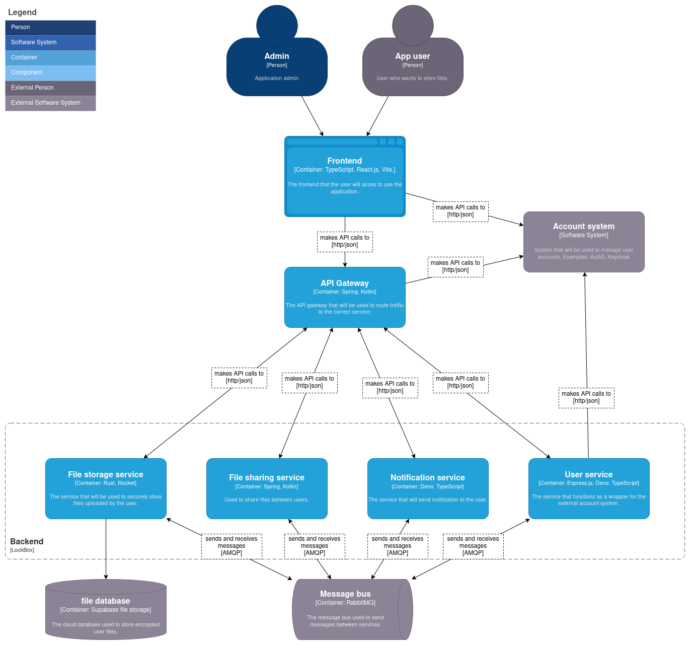
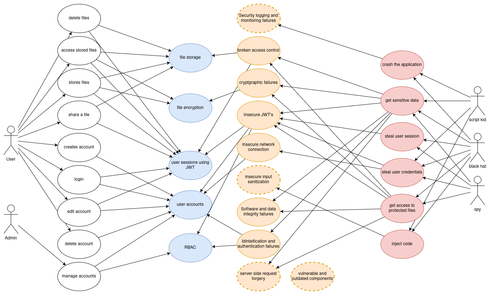

# Design  Document 

## Inleiding
Dit document probeert het design van de gebouwde applicatie duidelijk te maken aan de hand van verschillende diagrammen en bijbehorende documentatie. Zo is een "containerdiagram" uitgewerkt om het design van de applicatie duidelijk te maken. Ook is er een "misuse-case diagram" opgezet om te achterhalen wat de mogelijke zwakke plekken zijn van de applicatie op het gebied van security. 

---
## C4 diagrammen
C4 diagrammen worden gebruikt om de applicatie op een steeds dieper niveau uit te werken. Hier zullen een aantal van de C4 diagrammen worden gebruikt om het design van de applicatie te verduidelijken.

### C2 - Containerdiagram
De onderstaande containerdiagram toont het ontwerp van de LockBox applicatie. Het geeft de verschillende containers weer die kunnen worden gebruikt om deze applicatie te ontwikkelen. Let op dat zowel standaard gebruikers als beheerders verbinding maken met dezelfde frontend. Dit komt doordat de applicatie gebruik zal maken van **RBAC** (Role-Based Access Control).

**Micro Services**  
Er zijn een aantal keuzes gemaakt met betrekking tot de non-functional requirements. Als eerst is de keuze gemaakt om gebruik te maken van een *microservice architecture*. De applicatie heeft namelijk de non-functional requirement: *"Het systeem moet horizontaal schalen om meer/minder resources te gebruiken wanneer nodig"*. Een microservice architectuur maakt het mogelijk om horizontaal te schalen. Er kunnen namelijk (automatisch) meer services worden gestart om een grotere load te verdragen. Verder heeft LockBox de non-functional requirement: *"De applicatie heeft een up-time van 99.3%"*. Een microservice architectuur kan hier bij helpen aangezien services makkelijk automatisch vervangen kunnen worden wanneer ze tegen een runtime error aanlopen.

**Message Broker**  
De services zullen voor onderlinge communicatie gebruik maken van een *message broker*. De reden hiervoor is zodat de services niet op elkaars antwoord hoeven te wachten. Zo kunnen de services hun taken sneller voltooien, waardoor ze meer tijd over houden voor andere taken. Dit gaat helpen om te voldoen aan de non-functional requirements betreffende de bestand upload/verwijder tijd. 

**API Gateway**  
Zoals te zien zal er ook een API gateway worden gebruikt in de architectuur van LockBox. De reden hiervoor is zodat de frontend maar één API hoeft aan te spreken, die van de gateway. Dit maakt het voordelig voor de onderhoudbaarheid van de software. Ook kan de API gateway worden gebruikt om extra security controles uit te voeren op binnenkomende requests. 

**Accounts**  
De keuze is gemaakt om een external account systeem te gebruiken zodat JWT tokens gebruikt kunnen worden voor authenticatie. Dit had uiteraard ook in-house ontwikkeld kunnen worden, maar dit brengt veel security risico's met zich mee.

**Rust**  
Ook is de keuze gemaakt om de *Rust* programmeer taal te gebruiken voor de "File storage service". Dit omdat deze functionaliteit (het opslaan van bestanden) de kern is van de gehele applicatie. Dit wil zeggen dat deze service waarschijnlijk een grote load zal ontvangen, en Rust zou daarom kunnen helpen bij de performance van deze service. 

**User Service**  
Verder is te zien dat er een "User service" ontwikkeld zal worden, deze keuze heeft met meerdere non-functional requirements te maken. De keuze is echter voornamelijk gemaakt om het mogelijk te maken om accounts te verwijderen, zowel als alle data en opgeslagen bestanden die hierbij horen. Het account systeem zal worden ge-out-sourced naar een cloud provider, maar de gekoppelde bestanden zullen worden opgeslagen in een eigen database. Verder is de keuze gemaakt om TypeScript te gebruiken vanwege de grote hoeveelheid support voor de taal vanuit de meeste cloud services. 

---

## Misuse-case diagram

Misuse-case diagrammen kunnen worden gebruikt om overzichtelijk te maken op welke manieren een applicatie mogelijk misbruikt kan worden. Dit doet een misuse-case diagram door aan te geven wie potentieel de applicatie zou willen misbruiken. Vervolgens kan beredeneerd worden hoe deze verschillende actoren misbruik zouden kunnen maken, bijvoorbeeld XSS aanvallen op een frontend. Al deze potentiële strategieën kunnen vervolgens gekoppeld worden aan de verschillende functionaliteiten binnen de applicatie. Zo is heel duidelijk zichtbaar welke services gevaar lopen, en voor wat voor aanvallen.

Hieronder is het misuse-case diagram dat is gemaakt voor LockBox zichtbaar.

Zoals te zien bevat deze misuse-case diagram een extra "laag", er is namelijk ook aangegeven welke fout / vulnerability de risico's veroorzaken. Zo is niet enkel zichtbaar welke services gevaar lopen, maar ook waardoor deze risico's geïntroduceerd kunnen worden. 

Ook zijn er 3 risico factoren aangeven die niet tot een specifieke functionaliteit behoren, dit zijn:
- **Security logging and monitoring failures** - Alle services zullen logs moeten bijhouden en gemonitord moeten worden. Zo kan verdachte activiteit op tijd herkent en onderzocht worden. 
- **Insecure input sanitization** - Wat malafide actoren precies kunnen doen met deze vulnerability is afhankelijk van de functionaliteit waarin het zich bevindt. De frontend en API endpoints zullen goede security testing moeten bevatten om deze vulnerabilities te voorkomen. 
- **Server side request forgery** - Er zullen verschillende functionaliteiten ontwikkeld worden die meer dan 1 service nodig hebben om gebruikt te worden. Dit wil zeggen dat de services mogelijk HTTP requests naar elkaar zullen sturen wanneer een message broker niet ideaal is. In dit geval kunnen SSRF vulnerabilities ontstaan, hiervoor zal ook uitgebreid getest moeten worden.
- **Vulnerable and outdated components** - De applicatie zal verschillende libraries / componenten gebruiken die niet in-house ontwikkeld zijn. Deze kunnen outdated raken en vulnerabilities bevatten. Deze dependencies zullen daarom ook regelmatig gecontroleerd moeten worden, en ge-updated moeten worden. 