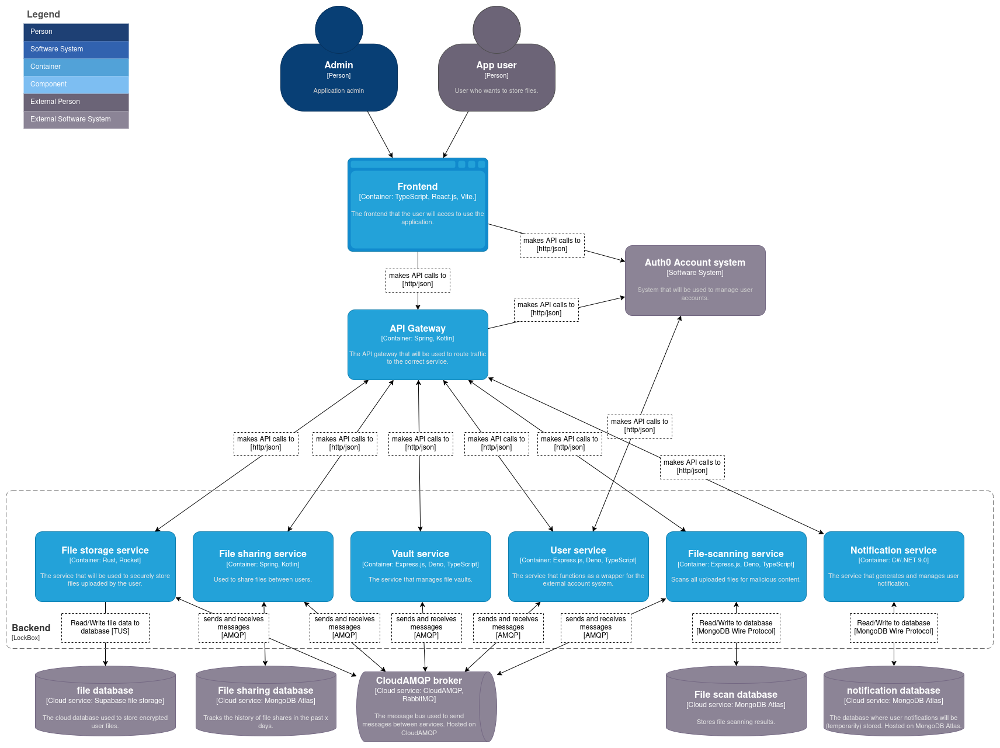

# Design  Document 

## Inleiding
Dit document zal het design van de gebouwde applicatie proberen duidelijk te maken aan de hand van verschillende diagrammen en bijbehorende documentatie. 

## C4 diagrams
C4 diagrammen worden gebruikt om op een steeds dieper niveau de applicatie uit te werken. Hier zullen een aantal van de C4 diagrammen worden gebruikt om het design van de applicatie te verduidelijken.

### C2 - container diagram
The container diagram below shows the design of the LockBox application. It displays the different containers that could be used to develop this application. Notice that both regular users and admin users will connect to the same frontend. This is because the application will make use of **RBAC** (Role Based Acces Control).

**Some extra details:**
- Uses **Rust** and **Rocket** in the file service to increase performance of the main functionality: file storage.
- Uses **Express.js**, **Deno** and **TypeScript** for the "*user service*" because it is easy to integrate with most popular authentication/authorisation services.

---
## Misuse-case diagram

Misuse-case diagrammen kunnen worden gebruikt om overzichtelijk te maken op welke manieren een applicatie mogelijk misbruikt kan worden. Dit doet een misuse-case diagram door aan te geven wie potentieel de applicatie zou willen misbruiken. Vervolgens kan beredeneerd worden hoe deze verschillende actoren misbruik zouden kunnen maken, bijvoorbeeld XSS aanvallen op een frontend. Al deze potentiële strategieën kunnen vervolgens gekoppeld worden aan de verschillende services binnen de applicatie. Zo is heel duidelijk zichtbaar welke services gevaar lopen, en voor wat voor aanvallen.

Hier onder is de misuse-case diagram die is gemaakt voor lockBox zichtbaar.

