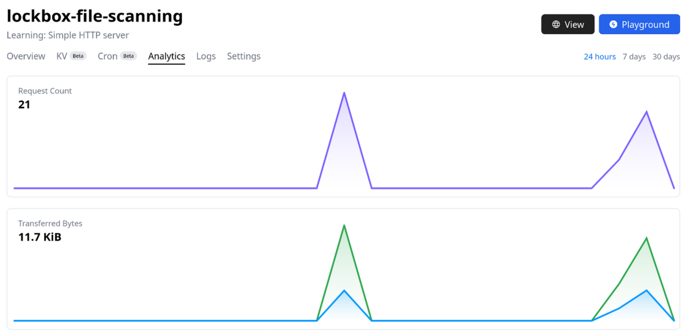

# Serverless functions
_Serverless functions_ zijn kleine stukjes code die draaien in de cloud zonder dat je zelf servers hoeft te beheren. In plaats van een hele applicatie continu te hosten, worden deze functies automatisch uitgevoerd als reactie op specifieke gebeurtenissen, zoals een HTTP-aanvraag, een bestand dat wordt geüpload of een bericht in een wachtrij.

Het grote voordeel is dat je je alleen hoeft te focussen op de logica van je code, terwijl de cloudprovider (zoals AWS Lambda, Azure Functions of Google Cloud Functions) zorgt voor de infrastructuur, schaalbaarheid en uptime. Je betaalt bovendien alleen voor het daadwerkelijke gebruik – dus geen kosten als de functie niet draait.


## Serverless functions in LockBox
Voor de LockBox applicatie is ook de keuze gemaakt om servless functions te gebruiken. Hiervoor wordt het [Deno Deploy](https://deno.com/deploy) platform gebruikt aangezien Deno al wordt gebruikt voor LockBox, en het platform heeft een gratis oplossing om mee te starten. 

Serverless functions kunnen op verschillende manieren worden toegepast, maar over het algemeen zijn ze vooral efficient voor het uitvoeren van simpele taken. Een van de services van het LockBox project kan daarom mogelijk goed vervangen worden door serverless functions: de "file scanning service". Deze service zal namelijk enkel de geüploade bestanden controleren op malware, een redelijk simpele taak. 

Om te controleren of deze service daadwerkelijk goed vervangen kan worden door serverless functions is een voorbeeld function opgezet voor het LockBox project. Hoe dit is gedaan, en de voor- en nadelen van deze oplossing, is allemaal hier terug te lezen.


## Implementatie in LockBox
Het hosten van een function in de cloud met Deno Deploy kan op twee verschillende manieren. De gebruiker kan een Deno project aanmaken en deze uploaden via de deno deploy terminal applicatie, maar het is ook mogelijk om de code in een online playground te schrijven. Voor LockBox is de keuze gemaakt om de cloud function uit te werken in de online playground voor het gemak. Als de function later beter uitgewerkt zal worden, is het handiger om hier een repository voor op te zetten zodat deze ook makkelijker lokaal getest kan worden om kosten te besparen. 

Om de cloud function aan te kunnen roepen van buitenaf kunnen meerdere strategieën gebruikt worden. Voor de file scanning function is de keuze gemaakt om deze via HTTP bloot te stellen. Zo kan deze met een simpel HTTP request worden gebruikt vanuit de andere services of de frontend. 

De code hier onder is de cloud function die voor LockBox is gedeployd. De logica voor het controleren van een bestand op malware is nog niet geïmplementeerd. Deze extra logica is voor nu niet belangrijk, de function is enkel opgezet als demonstratie.

```ts
function handler(req: Request): Response {
  try {
    const contentType = req.headers.get("content-type");
    if (!contentType || !contentType.includes("multipart/form-data")) {
      return new Response("Invalid content type. Expected multipart/form-data", {
        status: 400
      });
    }
    
    req.formData().then(value => {
      console.log(value);
      scanFormFile(value);
    });
    return new Response("File successfully scanned!", { status: 200 });
  } catch (err) {
    console.error("Error while processing request:", err);
    return new Response("Error processing request", { status: 500 });
  }
}

function scanFormFile(data: FormData) {
  const file = data.get("file");
  if (file) {
    // Scan the file for malware here...
    console.log("Scanning file for malicious content...");
  } else {
    throw new Error("Failed to get file data from the incoming form data");
  }
}

Deno.serve(handler);
```

De functie is nu bereikbaar over de hele wereld en wordt gehost op meerdere verschillende geografische locaties om de latency optimaal te houden. Aangezien de functie via HTTP wordt gehost, kan deze nu bereikt worden op het adres: *https://lockbox-file-scanning.deno.dev/* . Deze URL direct bezoeken zal resulteren in een error aangezien form data wordt verwacht door de function. 

Om de functie correct te gebruiken moet een `POST` request gestuurd worden naar dit adres. De function verwacht form-data met daarin het veld genaamd *"file"*. Wanneer dit het geval is zou normaal gesproken het bestand gescand worden, maar momenteel wordt enkel een `console.log()` aangeroepen als demonstratie. 

## Voor- en nadelen
Het opzetten van een cloud function voor het scannen van bestanden heeft ten eerste veel tijd bespaard in deployment. De ontwikkelaar hoeft enkel de code te schrijven, en de hosting wordt helemaal vanzelf geregeld. Dit maakt het onderhouden van de function erg gemakkelijk.

Een ander voordeel is het feit dat bij Deno Deploy standaard een aantal analytics terug te zien zijn, zowel als de logs van de function. Een nadeel aan deze analytics is wel dat deze niet opgehaald kunnen worden door een prometheus server (hier maakt LockBox gebruik van). Dit wil zeggen dat het moeilijk wordt om deze analytics bij de rest van de applicatie monitoring toe te voegen. 

*Analytics in Deno Deploy:*


Als laatste nadeel moet genoemd worden dat Deno Deploy enkel in staat is code te hosten geschreven voor de Deno runtime. Dit limiteert de keuze van de ontwikkelaar enorm, en het maakt het mogelijk ook lastig om later naar een andere oplossing over te stappen. 

*(Jammer genoeg is Deno niet de enige die "vendor lock-in" probeert te veroorzaken)*

## Prijs berekening
Deno Deploy heeft 3 verschillende subscription tiers:

| Tier       | Requests/month | Bandwidth             | Storage               |
| ---------- | -------------- | --------------------- | --------------------- |
| Free       | 1M             | 100GB                 | 1 GiB                 |
| Pro        | 5M (then $2/M) | 200GB (then $0.50/GB) | 5 GB (then $0.75/GiB) |
| Enterprise | Custom         | Custom                | Custom                |

Met de Pro tier kunnen standaard 5.000.000 requests per maand ontvangen worden. Een snelle berekening maakt duidelijk dat dit `5.000.000 / 30 / 24 = 6.944,44` requests per uur bedraagt. 

LockBox heeft de non-functional requirement: *"Het systeem moet minimaal 900,000 gebruikers tegelijkertijd aankunnen"*. Dit wil zeggen dat een gebruiker gemiddeld `6.944,44 / 900.000 = 0,00771604444444` files per uur mag scannen wanneer ze online zijn. Dit is dus maar 1 bestand per 129,6 uur dat de gebruiker de applicatie gebruikt. Dit is veel te weinig, het zou niet gek zijn als de gebruiker dit iedere 30 minuten deed. 

Uitgaande van de schatting dat de gebruiker iedere 30 minuten een bestand wil scannen, zal de extra prijs voor requests het volgende bedragen:
```txt
total files/hr = 2 (files/hr) * 900.000 = 1.800.000

total files/month = 1.800.000 * 24 * 30 = 1.296.000.000

requests to pay = monthly requests - 5M = 1.291.000.000
```
Met een extra ~1.3 biljoen requests om te betalen buiten de standaard subscription komen we uit op een prijs van: $0.5 * 1.3B = $648.000.000

Het is dus duidelijk niet de bedoeling om zo veel gebruikers te hebben op een Pro account. Deze kosten zijn natuurlijk te hoog om te betalen, en dan hebben we nog niet eens met de bandbreedte rekening gehouden. Normaal gesproken is in dit geval een enterprise account wenselijk om samen met Deno team een prijs af te stellen. 

## Conclusie
Voor het LockBox project is het een prima plan om het scannen van files op malware als serverless function uit te werken. Dit maakt het veel makkelijker om deze functionaliteit te uit te rollen wat veel kosten kan besparen in onderhoud. 

Het is jammer genoeg moeilijk om de prijs vooraf in te schatten zonder contact op te nemen met het Deno team. Het is in ieder geval niet schappelijk om een "Pro" account te gebruiken voor LockBox. 

Hierbij wordt er echter wel vanuit gegaan dat de file scanning logica überhaupt goed zelf ontwikkeld kan worden. Het zou namelijk goed kunnen dat het een beter plan is om hier een bestaande oplossing voor te gebruiken die potentieel niet in Deno Deploy uitgerold kan worden. 