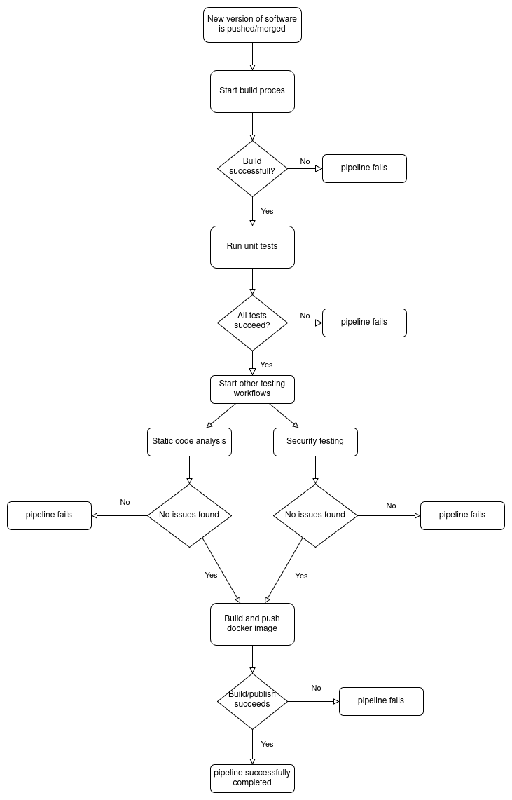
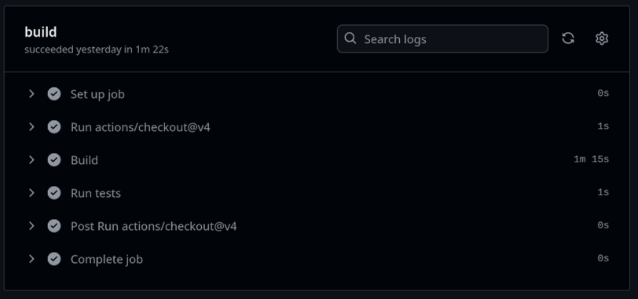
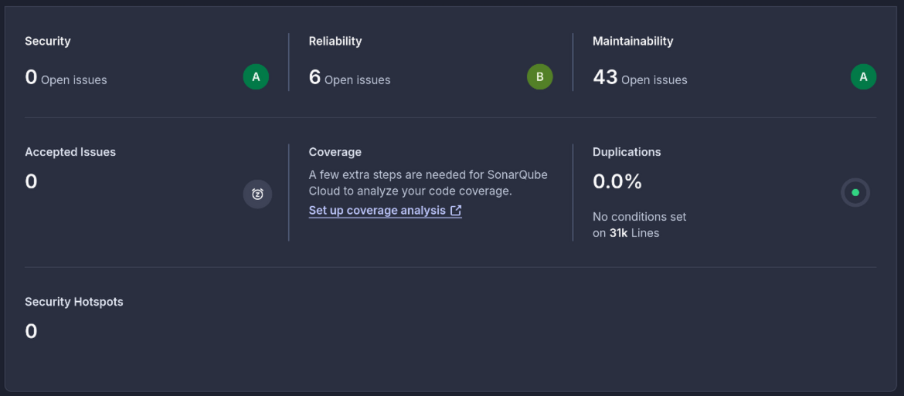
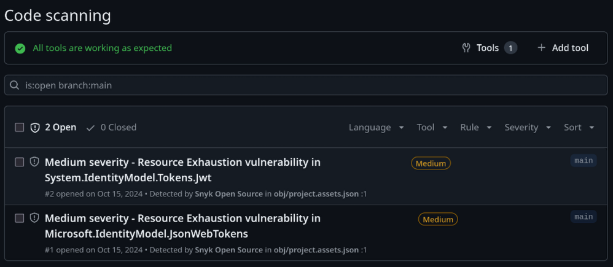

# CI/CD Pipeline
CI/CD staat voor _Continuous Integration_ en _Continuous Deployment/Delivery_. Het is een proces waarbij software automatisch wordt gebouwd, getest en gedeployed. CI/CD-pipelines helpen ontwikkelteams om sneller en betrouwbaarder software te leveren. Voor het LockBox project wordt ook gebruik gemaakt van CI/CD pipelines, en hier is terug te lezen hoe deze zijn ingedeeld. 

## Overview
De CI/CD pipelines worden voor het LockBox project voornamelijk gebruikt voor de volgende taken:
- Compileren van de software.
- Uitvoeren van tests om de functionaliteit te garanderen.
- Uitvoeren van tests om de non-functional requirements en performance te garanderen.
- Static code analysis om veel voorkomende programmeer fouten tegen te houden. 
- Security testing om vulnerabilities te voorkomen.
- Het bouwen en uitrollen van docker images. 

Afhankelijk van de specifieke microservice zal hier soms een extra stap worden toegevoegd, maar deze lijst geeft een goede samenvatting van de CI/CD pipelines. Om dit proces nog iets verder te verduidelijken is de flowchart hier benden uitgewerkt. Deze laat zien welke stappen worden doorlopen in de CI/CD pipelines, en op welke volgorde.



---

## Pipeline fases
Zoals zichtbaar in de flowchart zijn de CI/CD pipelines van LockBox in meerdere fases opgedeeld. Wat deze fases doen zal hier in meer detail worden uitgelegd. Ook zal duidelijk worden gemaakt hoe de fases zijn opgezet, en waarom.

### 1. Build
De eerste fase is het bouwen van de software. Aangezien niet alle services van de LockBox applicatie met dezelfde technologieën zijn geschreven, is dit proces vaak verschillend per service. 

De verschillende services van LockBox worden uitgerold als docker images, dit maakt dat deze build soms zinloos lijkt. Toch is dit een zinvolle fase aangezien zo aan het begin van de pipeline build issues al tegengehouden kunnen worden. Als de software niet gebouwd kan worden, hoeft/kan deze namelijk ook niet verder getest te worden. 

### 2. Unit testing
In de volgende fase worden unit-tests uitgevoerd om te controleren dat de applicatie op een functioneel niveau goed werkt. Deze testen zullen niet garanderen dat de software voldoet aan zijn [use-cases](https://rikdgd.github.io/rikdegoede-s6-docs/docs/Application-Design/analyse-document#use-cases). De tests zijn enkel bedoeld om de kleinere onderdelen van de logica te testen. 

Ook voor unit testing geld dat afhankelijk van de gebruikte technologieën, per service de gebruikte tools zullen verschillen. 

### 3. Static code analysis
De *static code analysis* fase wordt tegelijkertijd met de *security testing* fase gestart en loopt in parallel. Dit omdat deze twee fases tegelijkertijd kunnen starten en elkaar niet nodig hebben. Door de fases parallel uit te voeren kan tijd bespaard worden. 

Static code analysis wordt ook veel gebruikt voor security testing, en in LockBox is dit niet anders. Toch is static code analysis als een losse fase uitgewerkt aangezien het niet enkel wordt gebruikt voor security testing. Static code analysis kan namelijk ook inefficiënte code detecteren. 

Voor Static code analysis wordt in het LockBox project [SonarCloud](https://www.sonarsource.com/products/sonarcloud/) gebruikt. De keuze is gemaakt om SonarCloud te gebruiken aangezien deze software veel wordt gebruikt. Ook is een cloud oplossing wenselijk om onderhouds kosten en tijd te besparen.

### 4. Security testing
Security testing wordt gebruikt om vulnerabilities zo vroeg mogelijk tegen te houden. Hiervoor worden twee verschillende tools gebruikt: [Snyk](https://snyk.io/) en [ZAP](https://www.zaproxy.org/) (Zed Attack Proxy). 

#### SAST
Snyk wordt gebruikt voor het herkennen van vulnerabilities in de code voor deze is gecompileerd door static code analysis te gebruiken. SonarCloud voert ook static code analysis uit, en toch is ervoor gekozen om ook Snyk te gebruiken aangezien Snyk beter is gespecialiseerd op het gebied van security issues. Buiten dit is het met Snyk makkelijk om [SARIF](https://sarifweb.azurewebsites.net/) bestanden te genereren van de test resultaten. 

#### DAST
Verder wordt ZAP gebruikt voor dynamic code analysis. Dynamic code analysis wil zeggen dat vulnerabilities niet worden gevonden door de code te inspecteren, maar door tests uit te voeren tegen de applicatie wanneer deze draait. Dit is een meer realistische vorm van testen, maar is ook duurder om uit te voeren.  

De keuze is gemaakt om ZAP te gebruiken aangezien hier al ervaring mee is bij de ontwikkelaars, en ZAP veel wordt gebruikt in het bedrijfsleven. 

### 5. Deployment
De verschillende microservices worden ge- deployed in de vorm van een Docker image. Dit is nodig om ze in Kubernetes te gebruiken, en het maakt de applicatie makkelijk vervangbaar. 

Aangezien de docker images automatisch van een image repository gehaald kunnen worden, is de beste om de losse services te deployen via zo'n repository. Momenteel wordt [Docker Hub](https://hub.docker.com/) gebruikt als image repository aangezien dit de standaard repository is waar Kubernetes naar images zoekt. 

Om de images van de verschillende service to bouwen en deployen wordt een GitHub actions workflow gebruikt. De `YAML` configuratie van deze workflow/pipeline ziet er als volgt uit:
```yaml
name: Build and push Docker image  
  
on:  
  push:  
    branches: [ "main" ]  
  pull_request:  
    branches: [ "main" ]  
  
jobs:  
  build-and-push:  
    runs-on: ubuntu-latest  
  
    steps:  
    - name: Login to Docker  
      uses: docker/login-action@v3  
      with:  
        username: ${{ vars.DOCKERHUB_USERNAME }}  
        password: ${{ secrets.DOCKERHUB_TOKEN }}  
          
    - uses: actions/checkout@v4  
    - name: Build the Docker image  
      run: docker build . --file lockbox-notification-service/Dockerfile --tag rikdegoede/lockbox-notification-service:latest
    
    - name: Push to Dockerhub  
      run: docker push rikdegoede/lockbox-notification-service:latest
```

---
## Execution results
Om een korte demonstratie te geven van de resultaten van de CI/CD pipelines zijn hier een aantal screenshots terug te vinden van de verschillende onderdelen van de pipeline. Zo is duidelijk wat voor resultaten verwacht kunnen worden.

### Building & Unit testing
Het bouwen en testen van de software gebeurd in de pipeline zelf en hier zijn geen cloud service voor nodig buiten de GitHub Actions pipeline. 



De screenshot hierboven laat het resultaat zien van de "build & test" fase voor de *"file storage service"*. Zoals te zien slagen alle stappen hier. Mocht een van de unit tests of het bouwen van de software falen, dan faalt de gehele pipeline. 

### Static code analysis (SonarCloud)
De screenshot laat de resultaten van een SonarCloud scan zien op de frontend van de applicatie. Merk op dat de *"code coverage"* hier niet getoond wordt aangezien de frontend op het moment van deze scan nog geen unit testen bevat. 



### Security testing (Snyk)
De volgende afbeelding laat de resultaten van een Snyk security scan zien voor de *"user-service"*. Deze resultaten zijn bij de GitHub repository toegevoegd als security issues door gebruik te maken van `SARIF` bestanden.



### Security testing (ZAP)
*Scan is op `notification service` geïmplementeerd. Werkt nog niet volledig aangezien de workflow de applicatie nog niet succesvol draait. Dit zal hier later verder worden uitgewerkt.*