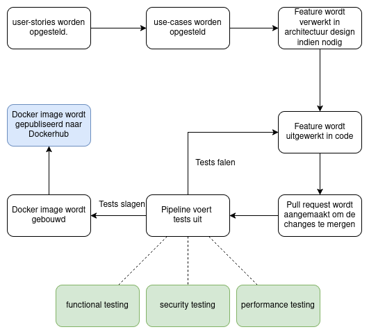

# Software Development Process

## Methodology
Voor het ontwikkelen van software kunnen veel verschillende strategieën worden gebruikt, en ieder ontwikkel team zal op zijn eigen manier aan de slag gaan. Toch zijn er een aantal veelgebruikte methodes voor het ontwikkelen van software waar ook bij het ontwikkelen van LockBox gebruik van is gemaakt. 

Voor het LockBox project is de keuze gemaakt om de **agile** principes te volgen zodat het makkelijker is om te voldoen aan de constant veranderende eisen van de software. Of specifiek te zijn is de keuze gemaakt om het **Scrum** framework te volgen gedurende het development proces. 

### Toepassing Scrum
#### Rollen
Het toepassen van rollen voor het LockBox project is niet zo voor zich sprekend aangezien er maar door een persoon aan het project wordt gewerkt. Dit betekend dat de enige ontwikkelaar de rol van *Product owner*, *Scrum master*, en het *development team* op zich neemt. Dit wil zeggen dat de ontwikkelaar van LockBox verantwoordelijk is voor het ontwikkelen van het product, maar ook hoe het product eruit moet komen te zien. Ook zal de ontwikkelaar zelf de sprints bewaken en zorgen dat de juiste features ontwikkeld worden.

#### Artifacts
Om bij te houden welke taken moeten worden uitgevoerd om het product te brengen tot de gestelde eisen is een **product backlog** opgezet. De taken die hier worden bijgehouden hebben geen specifieke volgorde aangezien dit per sprint bepaald wordt. Het is enkel een lijst met de taken die op lange termijn moeten worden uitgevoerd om het software project succesvol af te ronden. 

Voor het plannen van feature releases, bug fixes en andere development taken van de product backlog wordt in sprints gewerkt van 3 weken. Aan het begin van iedere sprint worden eerste de volgende taken uitgevoerd:
1. De **product backlog** wordt bijgewerkt om in lijn te blijven met de eisen van het product.
2. Er wordt een nieuwe selectie gemaakt met taken uit de backlog die het meest belangrijk zijn voor de komende sprint. Deze taken worden aan de sprint toegevoegd. 
3. Aan de nieuwe sprint wordt een einddatum gekoppeld voor duidelijkheid onder de ontwikkelaars.

## Workflow overview
Voor het ontwikkelen van een nieuwe features in de LockBox applicatie wordt een bepaalde workflow gevolgd. In de figuur hier onder is zichtbaar hoe dit proces er in grote lijnen uit ziet.

De stappen zijn ook als volgt te beschrijven:
1. **User stories opstellen** - Er worden user-stories opgezet om te zorgen dat de nieuwe functionaliteit goed gedocumenteerd zijn. Ook is dit een belangrijke tool om de functionaliteiten met de *product owner* te bespreken.
2. **Use-cases opstellen** - Use-cases zijn niet als user stories belangrijk om duidelijk te maken hoe een feature moet werken. Use-cases zijn echter vaak handiger voor de ontwikkelaars.
3. **Verwerken in architectuur design** - De feature moet mogelijk ook in het architectuur design worden verwerkt, bijvoorbeeld wanneer er een nieuwe microservice moet worden opgezet.
4. **Uitwerken in code** - Hier wordt de feature daadwerkelijk uitgewerkt in code, mogelijk als eerste versie.
5. **Pull-request** - Er wordt een pull request aangemaakt op GitHub om de code te mergen naar de correcte branch.
6. **Pipeline** - Door het openen van een pull request wordt automatisch de pipeline uitgevoerd in de vorm van een of meerdere *"GitHub actions workflows"*. Wanneer de tests in de pipeline falen kunnen de branches niet gemerged worden. Dit betekend dat de we terug gaan naar stap 4, de code zal verder moeten worden aangepast/uitgebreid totdat de tests slagen.
7. **Build Docker image** - Om de software makkelijk te kunnen deployen wordt een Docker image gebouwd. Zo zijn de software, dependencies en operating system mooi tot een *pakketje* samengevoegd. 
8. **Publish Docker image** - Tot slot wordt de Docker image gepubliseerd op DockerHub om ervoor te zorgen dat deze overal op te halen is. Zo kan deze makkelijk elders automatisch worden gedeployed, zoals bijvoorbeeld in een Kubernetes cluster. 

## Non-functional requirements
Er zijn voor LockBox verschillende *non-functional requirements* opgezet om een duidelijk beeld te hebben van de eisen van de applicatie. Deze non-functionals zijn erg belangrijk voor de applicatie en dus ook voor het DevSecOps proces. Toch is het moeilijk om iedere non-functional requirement even goed mee te nemen, en daarom zijn hier de 5 belangrijkste nog een te zien:

- **[NF-01]** Opgeslagen bestanden worden versleuteld met `AES-GCM` met 256 bits keys.
- **[NF-02]** Het systeem moet horizontaal schalen om meer/minder resources te gebruiken wanneer nodig.
- **[NF-05]** De applicatie heeft een up-time van `99.3%`.
- **[NF-06]** Het opslaan van een bestand duurt maximaal 1 minuut.
- **[NF-16]** De applicatie bevat geen vulnerabilities met een CVE score hoger dan 8.0.

Deze non-functional requirements zullen het meest in acht worden genomen in het DevSecOps process. 