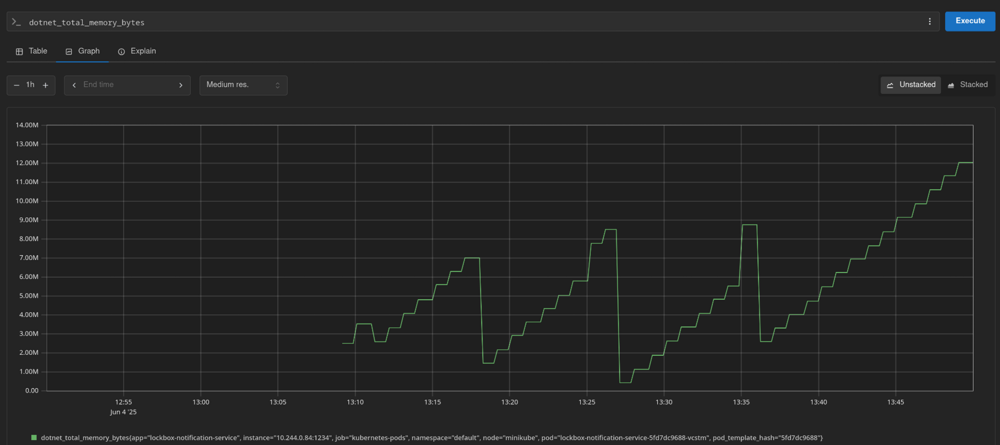
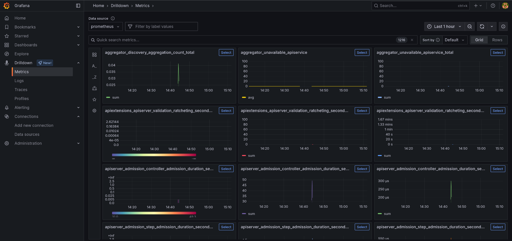

# Monitoring
Monitoring is het proces van het continu of periodiek verzamelen, analyseren en gebruiken van informatie om de prestaties, beschikbaarheid en algehele gezondheid van systemen, processen of diensten te bewaken. Het doel van monitoring is om ervoor te zorgen dat alles soepel en efficiënt verloopt, en om snel problemen te identificeren en op te lossen wanneer deze zich voordoen.

Voor het LockBox project zal ook monitoring worden ingezet. Het doel hiervan is om altijd een overzicht te hebben van de status van de verschillende micro-services en het kubernetes cluster. Ook is het met behulp van monitoring  makkelijker om te garanderen dat de applicatie voldoet aan de [non-functional requierements](https://rikdgd.github.io/rikdegoede-s6-docs/docs/Application-Design/analyse-document#non-functional-requirements). 

## Belangrijke metrics voor LockBox
Monitoring implementeren is vrij makkelijk, het is hierbij vooral belangrijk dat de juiste gegevens worden gemonitored. Voor LockBox zijn een aantal punten van extra belang voor monitoring. Welke punten dit zijn, en waarom deze belangrijk zijn, is hier terug te lezen.

### File uploads/downloads
De LockBox applicatie is bedoeld voor gebruikers om bestanden veilig te bewaren. Dit brengt echter een aantal risico's met zich mee, gebruikers zouden bijvoorbeeld de applicatie kunnen gebruiken om malware te verspreiden. Dit is uiteraard niet de bedoeling. Verder zouden problemen bij het uploaden/downloaden van bestanden voor problemen kunnen zorgen aangezien dit betekend dat gebruikers de applicatie niet kunnen gebruiken. Dit zou veel geld kunnen kosten, daarom is het belangrijk deze functionaliteiten goed te monitoren. 

### Beschikbare opslag
De beschikbare hoeveelheid opslag van de applicatie moet ook goed gemonitored worden, dit is ook terug te lezen in [non-functional requirement 14](https://rikdgd.github.io/rikdegoede-s6-docs/docs/Application-Design/analyse-document#non-functional-requirements). Dit is net als file downloads/uploads belangrijk om te zorgen dat de applicatie fatsoenlijk gebruikt kan worden. Wanneer de toegankelijke hoeveelheid storage te laag wordt, moet hier op tijd op ingegrepen kunnen worden. 

### Backups
Van de applicatie data zullen geregeld backups worden gemaakt om dataverlies te vermijden, dit is ook gedefinieerd in de non-funcional requirements (zie [NF-12](https://rikdgd.github.io/rikdegoede-s6-docs/docs/Application-Design/analyse-document#non-functional-requirements)). Mocht er iets niet goed lopen bij het maken van backups, dan zou dit met een beetje pech voor grote problemen kunnen zorgen. Daarom is het belangrijk om de automatische backups te monitoren. Het beste zou zijn om hier ook een alert op te zetten in het geval dat een backup faalt. Dit zou dan namelijk zo snel mogelijk opgelost moeten worden.

### Cluster gezondheid
De LockBox applicatie draait in Kubernetes om horizontaal te kunnen schalen. Dit is belangrijk voor LockBox om de grote hoeveelheid gebruikers aan te kunnen zonder te veel resources te gebruiken. Deze horizontale schaling moet wel blijven werken om te vermijden dat de applicatie te veel of te weinig resources gebruikt. Door dit goed te monitoren kunnen extra kosten vermeden worden. 

---
## Implementatie in LockBox
Hier is terug te lezen hoe monitoring is opgezet voor het LockBox project. Alle stappen die zijn gemaakt om monitoring op te zetten zijn hier uitgewerkt en uitgelegd. 

### 1. Metrics genereren
De eerste stap om monitoring mogelijk te maken, is om te zorgen dat er data is die gemonitord kan worden. Dit type data wordt ook wel *"metrics"* genoemd. Metrics bevatten vaak informatie zoals: response time, up-time, error logs, HTTP requests, en mogelijk nog veel meer. 

Kubernetes genereert van zichzelf metrics, dit maakt het makkelijk om het cluster zelf in de gaten te houden. Voor het monitoren van services zal de ontwikkelaar er zelf voor moeten zorgen dat metrics worden gegenereerd. 

#### Metrics generatie in LockBox
In LockBox worden door de "notification-service" metrics gegenereerd. Deze metrics worden voornamelijk gebruikt om de algemene status van de applicatie te monitoren. Om dit te implementeren is als eerst een metric server aan de microservice toegevoegd:
```cs
// Start collecting metrics for Prometheus  
using var server = new Prometheus.MetricServer(port: 1234);  
server.Start();
```

Vervolgens moet ook duidelijk worden gemaakt waar de metrics te vinden zijn voor andere services zodat een metric server (zoals Prometheus) deze kan vinden. Hiervoor zijn de volgende annotations aan de Kubernetes `deployment` toegevoegd:
```yaml
apiVersion: apps/v1
kind: Deployment
metadata:
  name: lockbox-notification-service
spec:
  replicas: 1
  selector:
	matchLabels:
	  app: lockbox-notification-service
  template:
	metadata:
	  labels:
		app: lockbox-notification-service
	  annotations:  # Add annotations for Prometheus metric server
		prometheus.io/scrape: "true"
		prometheus.io/port: "1234"
		prometheus.io/path: "/metrics"
```

### 2. Metric server in Kubernetes cluster (Prometheus)
De volgende stap is om te zorgen dat de metrics worden opgevangen en verwerkt om de data overzichtelijk te maken. Een veel gebruikte, open-source tool die hiervoor ingezet kan worden is **Prometheus**. 

Prometheus is in staat metrics te verzamelen en interpreteren. Dit maakt het mogelijk om acties te ondernemen aan de hand van de status van het cluster of verschillende microservices. Zo kan Prometheus bijvoorbeeld een notificatie sturen wanneer de algemene load van het cluster te hoog wordt, of wanneer een bepaalde service te traag reageert. Dit zorgt ervoor dat de ontwikkelaars op tijd problemen kunnen herkennen en verhelpen. 
In het geval van de LockBox applicatie kan prometheus bijvoorbeeld gebruikt worden om de gebruikte hoeveelheid memory in de gaten te houden. Zo kan deze bijvoorbeeld in een graph getoond worden:


#### Prometheus installatie:
```sh
# Add prometheus repository
helm repo add prometheus-community https://prometheus-community.github.io/helm-charts

# Update all helm repositories
helm repo update

# Install prometheus in the default namespace of the k8s cluster.
helm install prometheus prometheus-community/prometheus -n default
```

### 3. Grafana deployment
Alhoewel Prometheus prima in staat is metrics te verzamelen, is het soms niet de ideale oplossing voor het inzien van de verkregen metrics. Een populaire oplossing hiervoor is: *"Grafana"*, een tool voor het weergeven van metrics. Grafana kan grafieken genereren aan de hand van metrics waardoor deze voor mensen beter te begrijpen zijn. 

Grafana kan net al Prometheus worden ingezet om automatisch berichten te versturen bij bepaalde gebeurtenissen. Zo kunnen de ontwikkelaars op tijd worden geïnformeerd over nieuwe problemen. 


In het LockBox project is ook gebruik gemaakt van Grafana, in de afbeelding hier onder is zichtbaar welke metrics toegankelijk zijn bij een standaard deployment van Prometheus en Grafana in een Kubernetes cluster: 



#### Grafana deployment:
De volgende `YAML` configuratie is gebruikt om Grafana te deployen in het kubernetes cluster:

```yaml
apiVersion: v1
kind: PersistentVolumeClaim
metadata:
  name: grafana-pvc
spec:
  accessModes:
    - ReadWriteOnce
  resources:
    requests:
      storage: 1Gi
      
---

apiVersion: apps/v1
kind: Deployment
metadata:
  labels:
    app: grafana
  name: grafana
spec:
  selector:
    matchLabels:
      app: grafana
  template:
    metadata:
      labels:
        app: grafana
    spec:
      securityContext:
        fsGroup: 472
        supplementalGroups:
          - 0
      containers:
        - name: grafana
          image: grafana/grafana:latest
          imagePullPolicy: IfNotPresent
          ports:
            - containerPort: 3000
              name: http-grafana
              protocol: TCP
          readinessProbe:
            failureThreshold: 3
            httpGet:
              path: /robots.txt
              port: 3000
              scheme: HTTP
            initialDelaySeconds: 10
            periodSeconds: 30
            successThreshold: 1
            timeoutSeconds: 2
          livenessProbe:
            failureThreshold: 3
            initialDelaySeconds: 30
            periodSeconds: 10
            successThreshold: 1
            tcpSocket:
              port: 3000
            timeoutSeconds: 1
          resources:
            requests:
              cpu: 250m
              memory: 750Mi
          volumeMounts:
            - mountPath: /var/lib/grafana
              name: grafana-pv
      volumes:
        - name: grafana-pv
          persistentVolumeClaim:
            claimName: grafana-pvc
            
---

apiVersion: v1
kind: Service
metadata:
  name: grafana
spec:
  ports:
    - port: 3000
      protocol: TCP
      targetPort: http-grafana
  selector:
    app: grafana
  sessionAffinity: None
  type: LoadBalancer
```