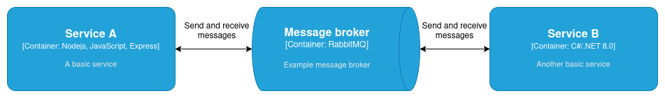

# Wat is messaging?

Er zijn veel verschillende manieren waarop software applicaties met elkaar kunnen communiceren. Al deze verschillende methodes bestaan omdat ze allemaal hun eigen voor- en nadelen hebben. Messaging is een manier voor applicaties om indirect data met elkaar uit te wisselen.

## "Message queues"
Het onderwerp messaging is groot, maar de basis is best makkelijk te begrijpen. Het idee achter messaging is namelijk dat berichten niet direct van service naar service worden verstuurd, maar naar een soort algemene berichten box. Wil een ander een bericht uitlezen, dan moet deze ook opgevraagd worden bij de berichten box, en niet bij de service. De diagram hier beneden visualiseert hoe dit eruit ziet.
 

Zoals zichtbaar komen service A en service B nooit direct met elkaar in contact. Beide services roepen de message broker aan om berichten te versturen. 

### Het voordeel
Het belangrijkste voordeel van messaging voor enterprise software is het feit dat services verder losgekoppeld worden van elkaar. Dit kan het beste worden uitgelegd aan de hand van een voorbeeld.

Stel een gebruiker wil al zijn geplaatste berichten ophalen. Normaal gesproken zou dan een bepaalde service worden aangesproken via bijvoorbeeld een REST api, en deze haalt dan alle gemaakte berichten op. Het nadeel is echter dat het ophalen van de berichten even kan duren, en al deze tijd is de applicatie aan het wachten tot de berichten zijn opgehaald. Deze wachttijd is ongewenst aangezien de applicatie tijdens het wachten niets ander kan doen. 

In het geval van messaging zou dit heel anders verlopen. Dit zou namelijk betekenen dat er in een message queue een bericht wordt achtergelaten dat aangeeft "ik wil alle berichten ophalen". Zodra dit bericht verstuurd is kan de service al verder met zijn werk. Er hoeft niet actief gewacht te worden aangezien het antwoord vanzelf verschijnt in de queue. 