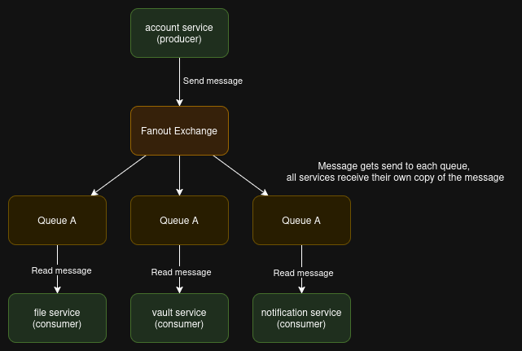

# Account verwijdering in LockBox
Volgens de AVG (GDPR) hebben gebruikers in veel gevallen het recht om te verzoeken dat hun persoonsgegevens worden verwijderd uit de systemen van een applicatie. De LockBox applicatie zal ook moeten voldoen aan deze eis, en daarom zal hier een feature voor geïmplementeerd moeten worden. Het doel van deze feature zal zijn dat de gebruiker zijn account volledig kan verwijderen, inclusief de bestanden die erop staan opgeslagen. Het verwijderen van de bestanden is natuurlijk ook de voorkeur voor LockBox om opslag ruimte en dus geld te besparen. 

In dit document is te lezen hoe deze feature is geïmplementeerd, en wat de plus- en minpunten van deze aanpak zijn. 

## Implementatie stappen
### 1. Start het proces
Om account verwijdering mogelijk te maken is als eerst een REST endpoint aangemaakt in de `user service`. Dit endpoint zal worden aangeroepen om account verwijdering van start te laten gaan. Aangezien LockBox een *event-driven architecture* gebruikt betekend dit dat de `user service` een *event* zal aanmaken dat aangeeft dat de gebruiker zijn account wil verwijderen. De andere services zullen hier zelf iets mee doen als dit nodig is. Het event is geïmplementeerd als een message in de CloudAMQP broker. De message heeft het volgende uiterlijk:
```json
{
    "EventType": "ACCOUNT_DELETION_REQUESTED",
    "Timestamp": "12:34:21 PM - Saturday, June 21, 2025",
    "Source": "user-service",
    "UserId": "test_user_3634",
    "Body": "The user has requested their account to be deleted."
}
```

### 2. Verwijderen van bestanden
Zoals eerder uitgelegd zullen de bestanden van de gebruiker ook uit de database verwijderd moeten worden. Dit wil zeggen dat de `file service` op het account verwijdering event moet inhaken. 

Om dit voor elkaar te krijgen spawned de `file service` een extra thread in de background om naar messages te luisteren in de `account queue`. Wanneer er een binnenkomt zal het verwijderen van de bestanden in gang gezet worden. 

### 3. File vaults
De `vault service` zal ook alle file vaults moeten verwijderen wanneer het bijbehorende account wordt verwijderd. Daarom luistert deze service ook naar het account verwijdering event. Wanneer de service een event in de account queue tegenkomt zal de volgende functie worden uitgevoerd:
```ts
async function handleAccountMessage(msg: amqp.Message) {
  try {
    const msgStr = msg.content.toString();
    const accountMsg: AccountMessage = JSON.parse(msgStr);

    if (accountMsg.EventType == 'ACCOUNT_DELETION_REQUESTED' && accountMsg.UserId) {
      // Connect to the database and delete all vaults from the removed account.
      const db = drizzle(Deno.env.get('DATABASE_URL')!);
      const queryRes = await db.delete(vaultTable)
        .where(eq(vaultTable.userId, accountMsg.UserId));

    }
  } catch (err) {
    console.error(`Failed to deserialize incoming message from ${ACCOUNT_QUEUE}: `, err);
  }
}
```
Deze functie kijkt of de ontvangen message van het event  `ACCOUNT_DELETION_REQUESTED` is, en zo ja verwijderd hij alle vaults van de gebruiker.

---
## Bug report
De huidige implementatie die in LockBox aanwezig is zal niet werken, het is  namelijk verkeerd geïmplementeerd in een structurele manier. Momenteel worden standaard queues gebruikt in de RabbitMQ broker voor het versturen en lezen van messages. Dit maakt het alleen onmogelijk voor alle verschillende services om het account verwijdering bericht te lezen, tenzij deze nooit verwijderd wordt. Dit is alleen ook geen goed plan aangezien dan de account verwijdering mogelijk oneindig wordt geactiveerd omdat het event nooit verdwijnt.

Het probleem: LockBox maakt geen gebruik van het *"Publish-Subscribe"* messaging patroon. Om dit probleem op te lossen zou er een *"Fanout Exchange"* aangemaakt moeten worden. In de diagram hier onder is zichtbaar hoe dit patroon eruitziet:

Met deze implementatie wordt de message naar de exchange gestuurd, en deze verstuurd dezelfde message naar iedere verbonden queue. Zou krijgt ieder service zijn eigen kopie van de message. Dit betekend dat deze veilig verwijderd kan worden wanneer de taken van de service succesvol zijn uitgevoerd. We hoeven ons geen zorgen te maken dat andere services de message missen.

---
## Verbeterpunten
De hier onder genoemde punten zorgen er niet perse voor dat de implementatie niet werkt, maar geven wel andere problemen die beter opgelost kunnen worden.

### Delete account endpoint
Het endpoint kan enkel bereikt worden door gebruikers die zich kunnen autoriseren. Momenteel wordt hier echter niet grondig genoeg gecontroleerd of de gebruiker zijn **eigen account** wil verwijderen of dat van een ander. Dit is uiterst belangrijk om te implementeren voor release. Anders zou het mogelijk zijn om andermans account te verwijderen. 

### File vault verwijdering
Het verwijderen van file vaults wordt momenteel zo snel mogelijk gedaan. Het zou echter beter zijn om te wachten tot alle bestanden verwijderd zijn om database problemen te voorkomen. 

### Wachten met "acknowledge"
De services van de LockBox applicatie verwijderen momenteel de account verwijdering message te snel, namelijk zo gauw zij deze ontvangen. In plaats daarvan moet de message pas verwijderd worden wanneer de uit te voeren acties afgerond zijn. Anders kan het zijn dat een message verwijderd wordt maar nooit wordt afgehandeld, bijvoorbeeld wanneer de service vastloopt. 

---

## Conclusie
De huidige implementatie voldoet nog niet aan de eisen, simpelweg omdat deze nog niet juist functioneert. Niet iedere service ontvangt de message omdat er geen *"Publish-Subscribe"* patroon is gebruikt. Wanneer dit succesvol is geïmplementeerd zou de account verwijdering moeten werken en voldoen aan GDPR, aangezien alle belangrijke data besproken in [GDPR-lockbox](https://rikdgd.github.io/rikdegoede-s6-docs/docs/distributed-data/GDPR-lockbox#datagebruik-analyse) wordt verwijderd. 