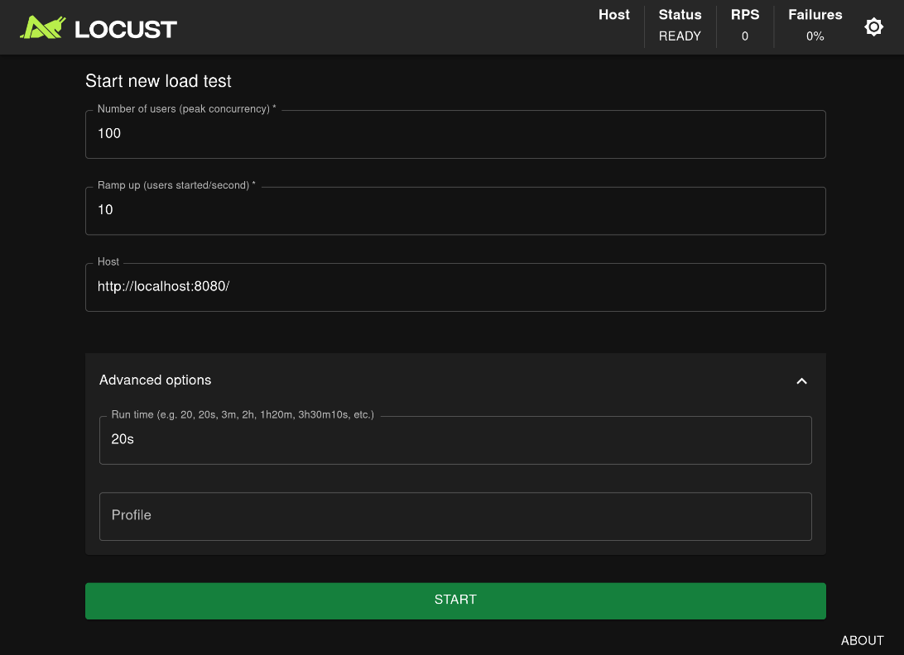
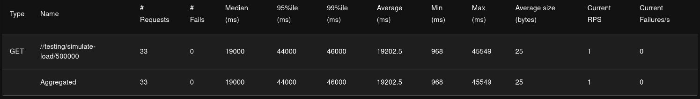
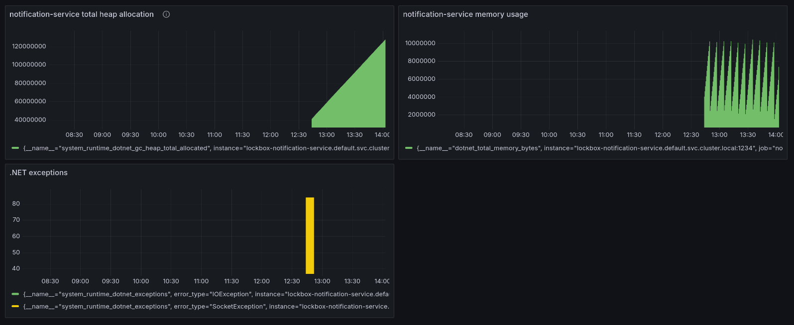
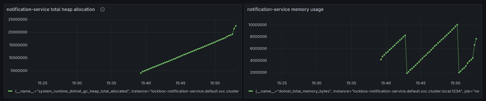

# Load Testing
In het vorige hoofdstuk ([Implementatie in LockBox](https://rikdgd.github.io/rikdegoede-s6-docs/docs/scalable-architectures/Microservices/implementatie)) is besproken hoe de verschillende micro-services van het LockBox project in Kubernetes opgezet kunnen worden. Het doel hiervan is om horizontale schaling mogelijk te maken zodat de applicatie kan voldoen aan zijn non-functional requirements. De benodigde setup is uitgevoerd, maar nog niet getest. 

Om te controleren of de applicatie nu goed schaalt zal *Load Testing* worden uitgevoerd. Hoe deze tests zijn opgezet, en wat de resultaten hiervan zijn, is hier allemaal terug te lezen.

## Wat is Load Testing?
Load testing is een type performance test in software development waarbij een systeem of applicatie wordt blootgesteld aan een normaal of verwacht gebruik om te bepalen hoe het systeem zich gedraagt onder verschillende belastingomstandigheden. Het doel van load testing is om de betrouwbaarheid, snelheid en schaalbaarheid van de applicatie te meten en te valideren. Tijdens het testen worden specifieke scenario's uitgevoerd die het gedrag van gebruikers simuleren, zoals het gelijktijdig openen van verbindingen of het uitvoeren van transacties, om te zien hoe het systeem reageert. Dit helpt ontwikkelaars om knelpunten te identificeren en te verhelpen, zoals trage reactietijden of systeemcrashes, voordat de applicatie in productie gaat.

## Test Aanpak
Voor het uitvoeren van Load tests kunnen verschillende tools gebruikt worden. Voor het LockBox project is de keuze gemaakt om [**Locust**](https://locust.io/) te gebruiken aangezien de ontwikkelaars hier al ervaring mee hebben, en Locust goed gedocumenteerd is. 

Locust is simpelweg een Python programma dat requests kan maken naar een of meerdere services. Dit maakt dat Locust tests zo complex gemaakt kunnen worden als de gebruiker wil door extra logica in Python te implementeren. Voor het testen van de scalability kan echter een simpele opzet gebruikt worden. De configuratie in Locust voor de test ziet er als volgt uit: 
```python
from locust import HttpUser, task

class TestingUser(HttpUser):
	@task
	def test_notifications(self):
	self.client.get("/")
	self.client.get("/notification/user-notifications/test_user_id")
	
```

Deze simpele test maakt HTTP requests naar de `/notifications` en `/user-notifications` REST endpoints van de notification service. Om de tests daadwerkelijk uit te voeren kan de locust web interface gebruikt worden:



Deze test zal gedurende de eerste 10 seconden steeds meer test gebruikers aanmaken, van 10 per seconde, tot 100 per seconde. De laatste 10 seconde van de test blijft het aantal test gebruikers op 100 staan. Deze gebruikers sturen allemaal requests naar de aangegeven endpoints. 

## Uitgevoerde tests
### Test 1
Om te controleren of het opgezette Kubernetes cluster in staat is om te schalen is een Locust test gebruikt met de volgende configuratie:
- **Number of users**: 1000
- **Ramp up**: 50
- **Run time**: 30s

Voor het starten van de load test heeft de deployment van de notification-service maar 1 pod draaien. Dit wil zeggen dat er maar 1 instance van de applicatie draait. Wanneer deze load test wordt gestart is de verwachting dat dit aantal zal stijgen. 

#### Resultaten:
Deze test faalde al vrij snel, het aantal gesimuleerde gebruikers bleek te hoog en de requests kwamen vanaf de 500 gebruikers simpelweg niet meer binnen. De volgende test zal dus met minder gebruiker moeten worden uitgevoerd, en moet minder snel nieuwe gebruikers toevoegen. 

### Test 2
Voor deze test is een extra Grafana dashboard opgezet om een beter overzicht te hebben van wat er gebeurd tijdens de test. Dit dashboard laat de volgende details zien:
- Het aantal exceptions waar de applicatie tegenaan loopt.
- De totale CPU load van de applicatie.
- Het totale heap memory gebruik van de applicatie.
Zo is nu zichtbaar hoe de load op de applicatie veranderd wanneer het aantal requests stijgt.

Verder is er nog een aanpassing gemaakt, het REST endpoint dat wordt aangesproken koste erg weinig rekenkracht om te voltooien. Daarom is er een extra GET endpoint opgezet om load te simuleren door priem getallen te bereken op het volgende path: `{service_address}/testing/simulate-load`. 

Tot slot zijn de waardes in Locust nu aangepast naar het volgende:
- **Number of users**: 50
- **Ramp up**: 1
- **Run time**: 60s

#### Resultaten:

In Locust was het volgende resultaat te zien aan het einde van de load test:


En op het Grafana dashboard is geen bijzondere activiteit terug te zien:


In de locust resultaten is zichtbaar dat de response time behoorlijk hoog is, met een gemiddelde van `19202.5` milliseconden (`19.2` seconden). Het lijkt er daarom op dat de service de load allemaal zelf moet afhandelen, en dit is ook het geval aangezien er nog steeds maar 1 pod aanwezig is gedurende de test. Dit maakt duidelijk dat horizontaal schalen nog niet werkt. 

Het lijkt er aan de hand van de `notification-service total heap allocation` grafiek op dat de load stijgt tijdens de test, dit is echter niet waarom deze grafiek stijgt. Deze stijging heeft namelijk een duur van 1 uur, terwijl de load test niet zo lang duurde (maar 60 seconden namelijk). Waar deze lineaire heap geheugen gebruik stijging vandaan komt, is nog niet duidelijk. 

### Test 3
Voor de zekerheid is dezelfde test uitgevoerd met nog minder gebruikers, de configuratie zag er als volgt uit:
- **Number of users**: 10
- **Ramp up**: 1
- **Run time**: 20s

#### Resultaten:
De service wordt nog altijd niet horizontaal geschaald, maar nu is wel duidelijk in Grafana zichtbaar dat de load verhoogd is:


Dit is fijn om te weten aangezien nu uitgesloten kan worden dat de fout in de test zit. 

### Test 4
Er is nog eens goed naar de configuratie gekeken van de `notification-service`. En het probleem zit mogelijk in de ingestelde resource limieten per pod.  Deze zijn namelijk als volgt ingesteld:
```yaml
resources:
  requests:
    memory: "128Mi"
    cpu: "100m"
  limits:
    memory: "256Mi"
    cpu: "200m"
```

Deze limieten zijn erg hoog en worden mogelijk niet geraakt waardoor de service niet zal schalen. Voor de volgende test zijn de limieten daarom met opzet te laag ingesteld tot het volgende:
```yaml
resources:
  requests:
    memory: "20Mi"
    cpu: "20m"
  limits:
    memory: "40Mi"
    cpu: "40m"
```

#### Resultaten:
bla bla bla