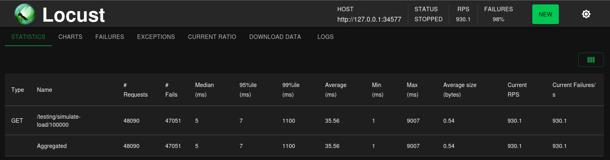
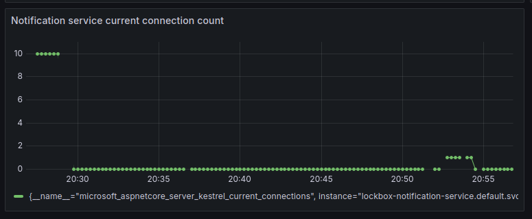

# Load Testing
In het vorige hoofdstuk ([Implementatie in LockBox](https://rikdgd.github.io/rikdegoede-s6-docs/docs/scalable-architectures/Microservices/implementatie)) is besproken hoe de verschillende micro-services van het LockBox project in Kubernetes opgezet kunnen worden. Het doel hiervan is om horizontale schaling mogelijk te maken zodat de applicatie kan voldoen aan zijn non-functional requirements. De benodigde setup is uitgevoerd, maar nog niet getest. 

Om te controleren of de applicatie nu goed schaalt zal *Load Testing* worden uitgevoerd. Hoe deze tests zijn opgezet, en wat de resultaten hiervan zijn, is hier allemaal terug te lezen.

## Wat is Load Testing?
Load testing is een type performance test in software development waarbij een systeem of applicatie wordt blootgesteld aan een normaal of verwacht gebruik om te bepalen hoe het systeem zich gedraagt onder verschillende belastingomstandigheden. Het doel van load testing is om de betrouwbaarheid, snelheid en schaalbaarheid van de applicatie te meten en te valideren. Tijdens het testen worden specifieke scenario's uitgevoerd die het gedrag van gebruikers simuleren, zoals het gelijktijdig openen van verbindingen of het uitvoeren van transacties, om te zien hoe het systeem reageert. Dit helpt ontwikkelaars om knelpunten te identificeren en te verhelpen, zoals trage reactietijden of systeemcrashes, voordat de applicatie in productie gaat.

## Test Aanpak
Voor het uitvoeren van Load tests kunnen verschillende tools gebruikt worden. Voor het LockBox project is de keuze gemaakt om [**Locust**](https://locust.io/) te gebruiken aangezien de ontwikkelaars hier al ervaring mee hebben, en Locust goed gedocumenteerd is. 

Locust is simpelweg een Python programma dat requests kan maken naar een of meerdere services. Dit maakt dat Locust tests zo complex gemaakt kunnen worden als de gebruiker wil door extra logica in Python te implementeren. Voor het testen van de scalability kan echter een simpele opzet gebruikt worden. De configuratie in Locust voor de test ziet er als volgt uit: 
```python
from locust import HttpUser, task

class TestingUser(HttpUser):
	@task
	def test_notifications(self):
	self.client.get("/notification/user-notifications/test_user_id")
	self.client.get("/testing/simulate-load/100000")
	
```

Deze simpele test maakt HTTP requests naar de `/notifications` en `/user-notifications` REST endpoints van de notification service. Om de tests daadwerkelijk uit te voeren kan de locust web interface gebruikt worden:


Deze test zal gedurende de eerste 10 seconden steeds meer test gebruikers aanmaken, van 10 per seconde, tot 100 per seconde. De laatste 10 seconde van de test blijft het aantal test gebruikers op 100 staan. Deze gebruikers sturen allemaal requests naar de aangegeven endpoints. 

---
## Uitgevoerde tests
### Test 1
Om te controleren of het opgezette Kubernetes cluster in staat is om te schalen is een Locust test gebruikt met de volgende configuratie:
- **Number of users**: 1000
- **Ramp up**: 50
- **Run time**: 30s

Voor het starten van de load test heeft de deployment van de notification-service maar 1 pod draaien. Dit wil zeggen dat er maar 1 instance van de applicatie draait. Wanneer deze load test wordt gestart is de verwachting dat dit aantal zal stijgen. 

#### Resultaten:
Deze test faalde al vrij snel, het aantal gesimuleerde gebruikers bleek te hoog en de requests kwamen vanaf de 500 gebruikers simpelweg niet meer binnen. De volgende test zal dus met minder gebruiker moeten worden uitgevoerd, en moet minder snel nieuwe gebruikers toevoegen. 

### Test 2
Voor deze test is een extra Grafana dashboard opgezet om een beter overzicht te hebben van wat er gebeurd tijdens de test. Dit dashboard laat de volgende details zien:
- Het aantal exceptions waar de applicatie tegenaan loopt.
- De totale CPU load van de applicatie.
- Het totale heap memory gebruik van de applicatie.
Zo is nu zichtbaar hoe de load op de applicatie veranderd wanneer het aantal requests stijgt.

Verder is er nog een aanpassing gemaakt, het REST endpoint dat wordt aangesproken koste erg weinig rekenkracht om te voltooien. Daarom is er een extra GET endpoint opgezet om load te simuleren door priem getallen te bereken op het volgende path: `{service_address}/testing/simulate-load`. 

Tot slot zijn de waardes in Locust nu aangepast naar het volgende:
- **Number of users**: 50
- **Ramp up**: 1
- **Run time**: 60s

#### Resultaten:
In Locust was het volgende resultaat te zien aan het einde van de load test:


En op het Grafana dashboard is geen bijzondere activiteit terug te zien:


In de locust resultaten is zichtbaar dat de response time behoorlijk hoog is, met een gemiddelde van `19202.5` milliseconden (`19.2` seconden). Het lijkt er daarom op dat de service de load allemaal zelf moet afhandelen, en dit is ook het geval aangezien er nog steeds maar 1 pod aanwezig is gedurende de test. Dit maakt duidelijk dat horizontaal schalen nog niet werkt. 

Het lijkt er aan de hand van de `notification-service total heap allocation` grafiek op dat de load stijgt tijdens de test, dit is echter niet waarom deze grafiek stijgt. Deze stijging heeft namelijk een duur van 1 uur, terwijl de load test niet zo lang duurde (maar 60 seconden namelijk). Waar deze lineaire heap geheugen gebruik stijging vandaan komt, is nog niet duidelijk. 

### Test 3
Voor de zekerheid is dezelfde test uitgevoerd met nog minder gebruikers, de configuratie zag er als volgt uit:
- **Number of users**: 10
- **Ramp up**: 1
- **Run time**: 20s

#### Resultaten:
De service wordt nog altijd niet horizontaal geschaald, maar nu is wel duidelijk in Grafana zichtbaar dat de load verhoogd is:


Dit is fijn om te weten aangezien nu uitgesloten kan worden dat de fout in de test zit. 

### Test 4
Er is nog eens goed naar de configuratie gekeken van de `notification-service`. En het probleem zit mogelijk in de ingestelde resource limieten per pod.  Deze zijn namelijk als volgt ingesteld:
```yaml
resources:
  requests:
    memory: "128Mi"
    cpu: "100m"
  limits:
    memory: "256Mi"
    cpu: "200m"
```

Deze limieten zijn erg hoog en worden mogelijk niet geraakt waardoor de service niet zal schalen. Voor de volgende test zijn de limieten daarom met opzet te laag ingesteld tot het volgende:
```yaml
resources:
  requests:
    memory: "20Mi"
    cpu: "20m"
  limits:
    memory: "40Mi"
    cpu: "40m"
```


Ook was de visualisatie in Grafana van de `notification-service total heap allocation` niet heel zinvol. Dit totaal wordt namelijk niet het huidige gebruik mee bedoeld, maar het totaal in de gehele geschiedenis van de service. Daarom blijft deze altijd stijgen, het zou beter zijn om het huidige heap memory gebruik te zien. Belangrijker nog is om het huidige aantal verbindingen te zien, daarom is hiervoor nu een visualisatie opgezet.

Tot slot is het mogelijk beter om de volgende test langer te laten duren. Daarom zal dit keer een test van 3 minuten worden uitgevoerd. 

#### Resultaten:
De resultaten zijn helaas niet veel belovend. De meeste requests van Locust falen, 98% om precies te zijn. 



Op het Grafana dashboard is echter wel te zien dat de service gedurende de test 10 connecties had zoals verwacht. Dit kan mogelijk komen doordat de requests wel worden ontvangen, maar zo lang duren om af te ronden dat locust het ziet als een gefaald request. Verder is te zien dat de pod ongeveer het aangegeven memory limiet van `40Mi` wel behaald. 

*(De rode streep geeft het moment waarom het maximale aantal verbindingen is bereikt aan.)*


Toch is het aantal pods gedurende de test niet gestegen, terwijl de service de load duidelijk niet aan goed aankon. Sterker nog, in Kubernetes is de deployment zo geconfigureerd dat deze al zou moeten schalen wanneer de gemiddelde memory load van alle pods op 50% ligt. Toch is de deployment niet gaan schalen bij een load van rond de 100%.


### Test 5 (het werkt)
Tot slot is een laatste test uitgevoerd met een kleinere gesimuleerde load op de services. Deze test had de volgende eigenschappen:
- **Number of users**: 10
- **Ramp up**: 1
- **Run time**: 60s
- **Simulated load**: De service ervaart maar `1/10` van de load uit voorgaande tests.

Het idee achter deze test is simpelweg dat een te grote load andere problemen kan veroorzaken die ervoor kunnen zorgen dat ook het schalen niet goed meer kan functioneren. Mogelijkdoor bijvoorbeeld het feit dat de service niet goed zijn metrics kan delen. Dit is echter maar een speculatie.

#### Resultaten:
Alhoewel achter deze test niet veel gedachten zaten, toch was dit wat het verschil maakte. Na enkele seconden was het volgende te zien op het Kubernetes dashboard:


**De deployment is succesvol horizontaal geschaald!** Het aantal pods is gestegen naar 7, en hier op gebleven tot de test voorbij was. Daarna zijn er voor ongeveer 2 minuten lang nog 7 pods geweest. Na de 2 minuten was het er nog maar 1. Precies zoals het hoort.

Wel moet de grafiek voor het totale aantal connecties in Grafana worden geupdate met een custom metric. Deze werkt namelijk niet aangezien de connecties verdeeld worden over meerdere pods. 


---
## Conclusie
De `notification service` van het LockBox project is nu in staat om mee te schalen met de load die hij ontvangt. Dit wil zeggen dat wanneer dit cluster gedeployed is, deze service altijd enkel de resources gebruikt die hij nodig heeft. Dit is een super waardevolle eigenschap aangezien dit enorm veel kosten kan besparen, in het bijzonder bij het gebruik van Cloud services. 

## Verbeterpunten
Alhoewel de notification service nu succesvol kan schalen, is niet helemaal duidelijk waarom deze dat niet deed bij een hogere gesimuleerde load. Een goede idee voor een vervolg onderzoek zou zijn om dit te achterhalen. Dit kan bijvoorbeeld worden gedaan door betere logging te implementeren, of door meer metrics te monitoren. Dit zou bij toekomstige tests mogelijk meer informatie kunnen geven.

Een ander belangrijk punt is het feit dat deze tests zijn uitgevoerd op een desktop computer met daarop "minikube" geïnstalleerd. Dit is verre van optimaal voor performance, sterker nog, Locust (de load testing software) gaf geregeld het volgende aan:
```txt
WARNING/root: CPU usage above 90%! This may constrain your throughput and may even give inconsistent response time measurements!
```

Kortom is het aan te raden om deze tests opnieuw, een geavanceerder uit te voeren. Het zou goed zijn om meer metrics te verzamelen, en een sterkere machine te gebruiken voor het uitvoeren van de load test.

---
## Advies 
Deze uitgevoerde tests tonen aan dat de opgezette architectuur in Kubernetes succesvol kan schalen. Dit is een mooi gegeven, maar voldoet de architectuur ook aan de [non-functional requirements](http://localhost:3000/rikdegoede-s6-docs/docs/Application-Design/analyse-document#non-functional-requirements) van de LockBox applicatie? Hiervoor is een extra test uitgevoerd waarvan hier beneden bij *"Upload speed test"* te lezen is hoe deze is opgezet.

De conclusie van deze test is dat de service niet voldoet aan de non-functional requirements. Dit komt hoogst waarschijnlijk door het feit dat dit cluster draait in [Minikube](https://minikube.sigs.k8s.io/docs/). Het is daarom aan te raden om deze applicatie later te deployen op een cluster met meer resources. Ook is het een goed idee om de upload tijden goed te blijven monitoren om hier problemen snel te detecteren. 

Tot slot moet worden opgemerkt dat deze non-functional requirement moeilijk te garanderen is aangezien er veel factoren spelen zoals: *internet snelheid, grote van het bestand, locatie van de uploader,* enzovoort. Om file uploads zo snel mogelijk te houden zal het noodzakelijk zijn om op zo veel mogelijk locaties de backend te draaien. Zo kan op zijn minst ervoor gezorgd worden dat de kwaliteit/snelheid van de verbinding niet de hinderende factor is voor de uploadsnelheid. De andere genoemde factoren zijn namelijk moeilijk te verhelpen. 

### Upload speed test
De volgende performance gerelateerde non-functional requirements zijn van het LockBox project:

- **(NF-6)** Het opslaan van een bestand duurt maximaal 1 minuut. Ook bij `900.000` gelijktijdige gebruikers.
- **(NF-7)** Het verwijderen van een bestand duurt maximaal 1 minuut. Ook bij `900.000` gelijktijdige gebruikers.
- **(NF-8)** Het verwijderen van een account duurt maximaal 5 minuten. Ook bij `900.000` gelijktijdige gebruikers. 
- **(NF-15)** Gebruikers kunnen bestanden opslaan met een maximale grote van `1 GB`.


De Kubernetes implementatie is pas echt succesvol wanneer de non-functional requirements behaald worden. Dit is echter lastig om goed te controleren met Locust, herinner de error onder het kopje "Verbeterpunten":
```txt
WARNING/root: CPU usage above 90%! This may constrain your throughput and may even give inconsistent response time measurements!
```

De response tijden zijn bij deze testen helemaal niet accuraat geweest, en dit zal daarom op een andere manier gemeten moeten worden. Hiervoor kan in de backend service zelf de execution time worden bijgehouden. 

De volgende configuratie is opgezet voor een Locust test van de "file upload" functionaliteit:
```python
class FileUploadUser(HttpUser):
	@task
	def upload_file(self):
		data = {
			"user_id": "test_user_id"
		}
		files = {
			"file": ("textfile.txt", open("testfile.txt", "rb"), "text/plain")
		}
		with self.client.post("/api", files=files, catch_response=True) as response:
			if response.status_code == 200:
				response.success()
			else:
				response.failure(f"Failed with status {response.status_code}")
```

Het uitvoeren van deze test gaf het volgende resultaat in Locust, dit resultaat is **NIET** te vertrouwen. Volgens Locust zal in de huidige deployment niet voldoen aan de non-functional requirement voor de upload snelheid (NF-6).


Het loggen van de verwerkingstijden in de service zelf gaf het volgende resultaat:
```txt
...

INFO - File uploaded in 1109 millis
INFO - Outcome: Success(200 OK)
WARN - Remote left: client disconnect before response started.
INFO - File uploaded in 1107 millis
INFO - Outcome: Success(200 OK)
WARN - Remote left: client disconnect before response started.
INFO - File uploaded in 1106 millis
INFO - Outcome: Success(200 OK)
WARN - Remote left: client disconnect before response started.
INFO - File uploaded in 1106 millis
INFO - Outcome: Success(200 OK)
WARN - Remote left: client disconnect before response started.
INFO - File uploaded in 68316 millis
INFO - Outcome: Success(200 OK)
WARN - Remote left: client disconnect before response started.

...
```

Zoals te zien aan de logs voldoet de huidige deployment daadwerkelijk niet aan de non-functional requirement voor uploadsnelheid. Meestal zit de service rond de 10% boven de benodigde upload tijd, maar in sommige gevallen duurt het zelfs meer dan een minuut. 