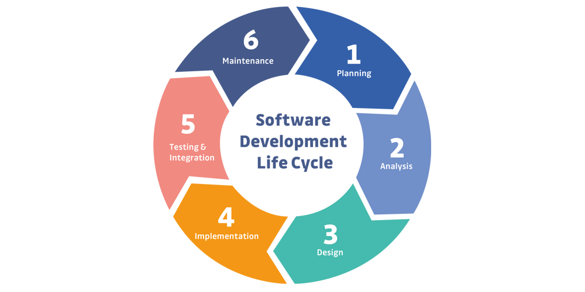

# Security Life Cycle
Bij het ontwikkelen van software doorloopt de ontwikkelaar meestal verschillende fases. Al deze fases bij elkaar worden ook wel de **Software Development Life Cycle** (SDLC) genoemd. Deze fases zijn in de afbeelding hier onder nog eens gevisualiseerd, en zoals te zien is het een cyclus die de ontwikkelaar meerdere malen zal doorlopen zolang de eisen van de software veranderen. 

Om software op een veilige manier te ontwikkelen is het belangrijk dat de ontwikkelaar in iedere fase van deze cyclus bezig is met de security. Het ontwikkelen van een veilige applicatie vereis namelijk meer dan het toepassen van een aantal standaarden. Iedere applicatie is anders en fouten in het design kunnen tot grote gevolgen leiden.

In dit document is terug te lezen hoe voor het LockBox project rekening is gehouden met security in iedere fase van de **SDLC**. Hierbij is vooral de focus gelegd op de volgende twee [user stories](https://rikdgd.github.io/rikdegoede-s6-docs/docs/Application-Design/analyse-document#user-stories):
- **(US-01)** Als gebruiker wil ik bestanden _veilig_ kunnen opslaan.
- **(US-02)** Als gebruiker wil ik een opgeslagen bestand kunnen downloaden.




## 1. Planning
Bij het maken van een planning voor het LockBox project is ten eerste de keuze gemaakt om Agile te werk te gaan. Zo ontstaan er minder problemen in de planning wanneer een vulnerability wordt gevonden die spontaan prioriteit krijgt. 

Ook is voor LockBox de OWASP top 10 erbij gepakt om te zien welke vulnerabilities waarschijnlijk belangrijk gaan zijn voor LockBox. Aan de hand hiervan is een misuse-case diagram opgesteld, dit diagram laat zien wat potentieel de zwakke plekken zullen zijn voor de verschillende functionaliteiten. 

Wat betreft het uploaden en downloaden van bestanden, hier is genoeg tijd voor ingepland. Aangezien deze functionaliteiten zo belangrijk zijn is er goed op gelet om hier genoeg tijd voor vrij te maken. Ook is specifiek tijd ingepland om te onderzoeken hoe deze functionaliteiten het best beveiligd kunnen worden. Hier kwam in eerste instantie uit dat lokale opslag prima kan werken, tot dat tijdens onderzoek de cloud service *"[Supabase - storage](https://supabase.com/storage)"* gevonden werd. 

Dit onderzoek heeft ook geleid tot de volgende non-functional requirements: 
- **(must-have NF-01)** *"Opgeslagen bestanden worden versleuteld met `AES-GCM` met 256 bits keys."* 
- **(Should-have NF-01)** *"Bestanden worden enkel versleuteld over het netwerk verstuurd."*

Door de bestanden goed te versleutelen zijn deze automatisch ontoegankelijk zonder de private key. Dit maakt het in ieder geval vrij lastig om file content te lekken. De enige manier waarop dit nog zou kunnen gebeuren is door een fout in de encryptie implementatie, of in de toekomst door quantum computers.

---
## 2. Defining Requirements
Bij het opstellen van requirements is ook goed nagedacht over de beveiliging. In de planningsfase is al achterhaald dat cryptografische problemen ernstig zouden zijn voor LockBox. Daarom is de volgende non-functional requirement opgezet: 
*"Opgeslagen bestanden worden versleuteld met `AES-GCM` met 256 bits keys."* 
AES-GCM is een algoritme dat voldoet aan de hedendaagse [standaarden voor cryptografie volgens NIST](https://csrc.nist.gov/projects/block-cipher-techniques). 

Ook is de volgende non-functional requirement opgezet om te voorkomen dat de bestanden "gebruikt" worden door LockBox voordat deze versleuteld zijn:
*"Bestanden worden enkel versleuteld over het netwerk verstuurd."*

Buiten deze twee zijn er een aantal andere non-functional requirements opgesteld met als doel de veiligheid van de (web)applicatie waarborgen:
- **(NF-03)** De applicatie maakt gebruik van `HTTPS`.
	- Versleuteld netwerk verkeer voorkomt grotendeels dat anderen gevoelige informatie kunnen stellen uit HTTP requests.
- **(NF-12)** Data moet iedere 5 minuten worden gebackuped.
	- Data backups voorkomen geen vulnerabilities, maar verminderen wel de schade die deze kunnen aanrichten.
	- Hoe meer backups, hoe minder dataverlies bij ongevallen.
- **(NF-13)** Applicatie en systeem logs worden bewaard voor minstens 30 dagen.
	- Logs helpen bij het opsporen van problemen, het is belangrijk dat deze lang genoeg worden bewaard aangezien deze niet altijd snel gevonden hoeven te worden. 
- **(NF-14)** Het systeem bevat real-time monitoring van API gebruik, beschikbare opslag en performance.
	- Monitoring kan in het algemeen goed helpen bij het detecteren van problemen, bijvoorbeeld wanneer het aantal requests ineens 10x zo groot wordt. 
- **(NF-16)** De applicatie bevat geen vulnerabilities met een CVE score hoger dan 8.0.

*Deze non-functional requirements zijn ook [hier](https://rikdgd.github.io/rikdegoede-s6-docs/docs/Application-Design/analyse-document#non-functional-requirements) terug te vinden.*

Buiten dit is iedere sprint gecontroleerd of nieuwe features de veiligheid van de opgeslagen bestanden kunnen beïnvloeden. Daarom is bijvoorbeeld de *"File scanning service"* opgezet wanneer gebruikers bestanden moesten kunnen delen met elkaar. Hierover meer bij het onderdeel **"3. Designing Architecture"**.

---
## 3. Designing Architecture
Bij het designen van de architectuur zijn een aantal keuzes gemaakt met security in gedachten. Een verandering was echter bij verre het meest belangrijk voor de veiligheid van de opgeslagen bestanden. 

#### end-to-end encryption
In de oude architectuur werd encryption namelijk uitgevoerd door de "file storage service". Aangezien deze service HTTPS gebruikt zijn de bestandsgegevens wel versleuteld op het netwerk, maar niet wanneer ze aankomen bij de service. Dit heeft 2 grote nadelen:
1. Mocht een malafide actor toegang krijgen tot de backend, dan kan deze technisch gezien de bestandsdata zien van bestanden die worden ge- upload/download.
2. Dit is geen end-to-end encryption, aangezien de bestanden niet bij de gebruiker worden versleuteld.

Daarom is de keuze gemaakt om de versleuteling in de frontend plaats te laten vinden. Zo is end-to-end encryptie aanwezig en wordt het een stuk lastiger om gevoelige data te stelen. Ook maakt dit de LockBox applicatie een stuk beter te vertrouwen aangezien de gebruiker nu zeker weet dat ook de ontwikkelaars van LockBox niet de bestanden kunnen uitlezen. 

#### RBAC
Zo heeft de LockBox applicatie bijvoorbeeld de non-functional requirement: *"Het systeem bevat een `RBAC` systeem zodat iedere gebruiker de juiste rechten bezit"*. Het goed implementeren van een RBAC systeem is alleen geen makkelijke taak. Fouten in dit soort systemen zijn vaak catastrofaal aangezien deze fouten er voor kunnen zorgen dat gebruikers te veel rechten krijgen. 

Om te zorgen dat voor het LockBox project de kans op fouten in het RBAC systeem zo laag mogelijk blijven, is de keuze gemaakt om hier een cloud service voor te gebruiken. Daarom maakt LockBox gebruik van [Auth0](https://auth0.com/) voor het implementeren van een RBAC systeem. 


#### File scanning service/function
In de tweede sprint is ook de keuze gemaakt om een extra service toe te voegen aan de applicatie. Deze service heeft als taak het controleren van geüploade bestanden om te garanderen dat deze geen malware bevatten. Als de bestanden malware bevatten maakt dit niet veel uit voor LockBox zelf aangezien de bestanden worden versleuteld. Wel zou het uitmaken voor de klanten aangezien op deze manier wel malware verspreid kan worden wanneer gebruikers de bestanden weer downloaden. 

In Sprint 6 is echter weer de keuze gemaakt om deze service te vervangen door een cloud function op Deno Deploy aangezien de service maar een functionaliteit bezit. Dit bespaard kosten en moeite wat betreft de hosting. Hier is meer over te lezen in het document: [Serverless functions](https://rikdgd.github.io/rikdegoede-s6-docs/docs/Cloud-Native/serverless-functions).

---
## 4. Developing Product
Tijdens het ontwikkelen van het product zijn ook een aantal maatregelen genomen om security gerelateerde problemen te vermijden. Ook hierbij is uiteraard rekening gehouden met de veiligheid van de bestanden van de gebruiker. 

#### Test database
Ten eerste is voor development een docker compose omgeving opgezet met hierin een testing database voor bestanden. Zo kunnen de file upload en download functionaliteiten  makkelijk worden getest zonder de daadwerkelijke gebruikers gegevens op het spel te zetten. 

#### Security config
In de `file storage service` is een (security)configuratie opgezet. Deze configuratie wordt onder andere gebruikt om de bestand-grote te limiteren en ziet er als volgt uit:
```toml
[default]
address = "127.0.0.1"
port = 8081
workers = 16
log_level = "critical"
cli_colors = false
ident = "FileStorageService"

[default.limits]
form = "64 kB"
json = "1 MiB"
msgpack = "2 MiB"
"file" = "1 GiB"
```
Zoals te zien kunnen geüploade bestanden maximaal een grote van 1 GiB hebben, dit is in lijn met [non-functional requirement 15](https://rikdgd.github.io/rikdegoede-s6-docs/docs/Application-Design/analyse-document#non-functional-requirements). Ook is het `log_level` naar critical gezet zodat het Rocket framework ook deze uploads bijhoudt. Verder is er ook een logging message toegevoegd aan het uploaden van een bestand zodat hierbij ook extra informatie meegegeven kan worden zoals de gebruiker die het bestand (probeerde) uploaden. Tot slot zijn er ook limieten ingesteld voor `form` en `json` data om het moeilijker te maken hier grote payloads te injecteren, mocht dit mogelijk zijn. 

#### Secrets
Verder zijn voor de verschillende secrets, zoals bijvoorbeeld de connection string van de file database, steeds environment variables gebruikt in combinatie met lokale `.env` bestanden. Zo is voorkomen dat gevoelige data wordt gelekt, zonder dat dit veel moeite kost tijdens development.

#### SAST
Het LockBox project maakt ook gebruik van verschillende CI/CD pipelines. Hieraan is Snyk toegevoegd om automatisch SAST toe te passen op de LockBox applicatie. Voor het uploaden en downloaden van bestanden is het vooral belangrijk dat de applicatie goede input validation heeft. Zo niet dan zouden gebruikers namelijk bestanden kunnen uploaden die bijvoorbeeld te groot zijn, dit zou namelijk voor financiële problemen kunnen zorgen.  Om dit te voorkomen is daarom het testen van de frontend vooral van belang. Het testen van de file storage service is ook geprobeerd, maar deze is in `Rust` geschreven en hiervoor hebben de populairste SAST tools (waaronder Snyk) nog geen support. 

---
## 5. Product Testing and Integration
#### Loadtesting
Om te testen dat file uploads goed presteren is [load testing](https://rikdgd.github.io/rikdegoede-s6-docs/docs/scalable-architectures/Microservices/load-testing#upload-speed-test) uitgevoerd met een stijgend aantal test gebruikers. Deze test is opgezet met `Locust` en daardoor makkelijk te herhalen of aan een DevSecOps pipeline toe te voegen om dit te automatiseren. 

#### SAST / DAST
Zoals al vermeld bij **"4. Developing Product"** wordt Snyk SAST gebruikt om te controleren of de frontend applicatie vulnerabilities bevat. Voor de file uploads (US-01) is het vooral belangrijk dat de frontend geen vulnerabilities bevat rondom "insecure input sanitization". Een onveilige sanitization zou ertoe kunnen leiden dat gebruikers bestanden kunnen uploaden die zij niet zouden moeten mogen uploaden. 

Ook DAST wordt uitgevoerd op de LockBox applicatie. Hiervoor wordt OWASP ZAP gebruikt in een GitHub actions pipeline zodat deze tests automatisch worden uitgevoerd. Door de backend met DAST te controleren kan ook worden achterhaald of er potentieel fouten zitten in de validatie bij het uploaden van een bestand. 

---
## 6. Deployment and Maintenance of Products
#### Kubernetes config
De LockBox applicatie draait in een Kubernetes cluster door gebruik te maken van **Docker** images. De applicatie wordt daarom als docker images gedeployed naar Docker Hub, Kubernetes kan deze automatisch ophalen. 

De configuratie van het Kubernetes cluster is in `YAML` formaat gedefinieerd in zijn eigen [git repository](https://github.com/LockBox-CS-S7/lockbox-k8s). Zo is versiebeheer toegankelijk voor de cluster architectuur wat het makkelijker maakt om naar een vorige versie terug te rollen. 

#### Secrets
Zoals al eerder benoemd in de vorige stappen zijn environment variables in combinatie met `.env` bestanden gebruikt om het makkelijk te maken veilig met secrets om te gaan. In deployment worden de benodigde secrets in een *"secret store"* bewaard zodat deze goed beveiligd zijn. Deze secret store wordt vervolgens gebruikt voor het initialiseren van de benodigde environment variables per service. 

*Voorbeeld Kubernetes secrets:*
```yaml
apiVersion: v1
kind: Secret
metadata:
  name: lockbox-secrets
type: Opaque
stringData:
  mongodb-conn-string: "temp"
  rabbitmq-conn-string: "temp"
```

#### Monitoring / logging
De services in het LockBox cluster worden gemonitord met behulp van **Prometheus** en **Grafana**. Zo is er altijd een dashboard aanwezig met de huidige status van de applicatie. Momenteel wordt het cluster en .NET gemonitored, in de toekomst is het hoogstens aan te raden om ook de file downloads/uploads te monitoren. Hiervoor zal een custom metric nodig zijn. 

Ook is logging is geïmplementeerd voor het LockBox project. Zo worden bijvoorbeeld ook de file uploads ge- logged. Hierbij wordt bijgehouden hoe lang het uploaden van het bestand duurde vanwege de non-functional requirement: *"Het opslaan van een bestand duurt maximaal 1 minuut."*
```rust
info!("File uploaded in {} millis by user: {}", now.elapsed().unwrap().as_millis(), message.user_id);
```
