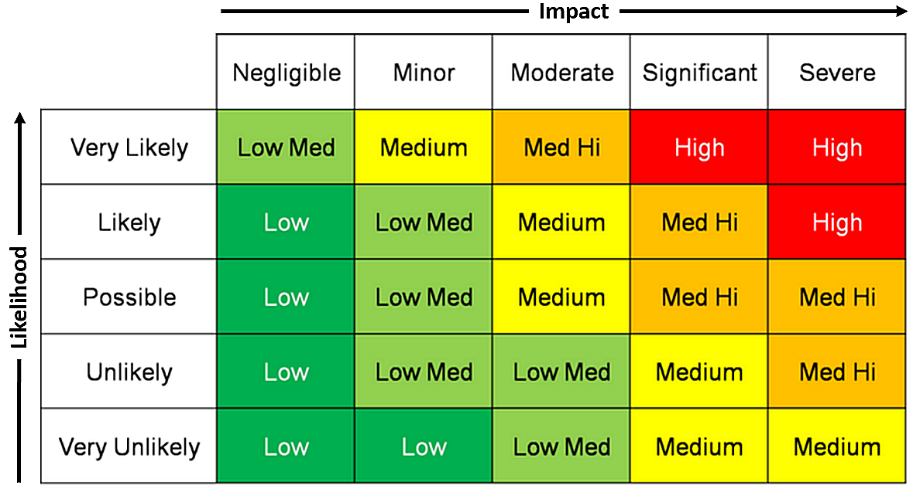

# Risk Assessment
In de snel evoluerende wereld van softwareontwikkeling is het identificeren, analyseren en beheren van risico’s essentieel om succesvolle projecten op te leveren. **Risk assessment** – oftewel risicoanalyse – is een systematisch proces dat helpt om potentiële problemen vroegtijdig te vinden, zodat ze proactief kunnen worden aangepakt voordat ze de kwaliteit of het budget van een softwareproject in gevaar brengen.

Binnen softwareontwikkeling kunnen risico’s zich op verschillende niveaus bevinden: van technische risico’s zoals bugs, integratieproblemen of onvoldoende schaalbaarheid, tot organisatorische risico’s zoals onduidelijke vereisten, personeelsverloop of veranderende klantbehoeften. Het is daarom belangrijk dat een risico analyse niet enkel op de technische details focused, maar ook op de bedrijfsprocessen. 

In dit document is een (korte) risico analyse terug te vinden voor het LockBox project. 

## Potentiële risico's
De LockBox applicatie is een web-applicatie voor het veilig in de cloud op slaan van bestanden. Hiervoor zijn verschillende risico's te bedenken, maar gelukkig is er al eerder een [misuse-case diagram](https://rikdgd.github.io/rikdegoede-s6-docs/docs/Application-Design/Design-Document#misuse-case-diagram) opgezet die al tot veel ideeën heeft geleidt. Een aantal potentiële risico's zijn hier met een korte uitleg terug te vinden. 

De risico's hier beneden zijn afkomstig van de [OWASP top 10](https://owasp.org/www-project-top-ten/#). Dit is een lijst met de top 10 meest voorkomende vulnerabilities in web applicaties. Aangezien de LockBox applicatie ook een webapplicatie is zijn de meeste van deze risico's relevant. 

#### 1. Security logging en monitoring failures.
Dit is en redelijk algemeen risico voor iedere applicatie. Het niet bijhouden van voldoende logs, of de applicatie niet goed actief monitoren kan er voor zorgen dat het moeilijker wordt om problemen te herkennen met de applicatie. Buiten dit maakt goede logging het makkelijker om problemen op te sporen en te verhelpen. 
#### 2. Broken access control.
Gebruikers zullen de applicatie gebruiken om bestanden op een veilige manier in de cloud op te slaan. Dit zullen zij doen door de bestanden op hun account te uploaden. Deze bestanden zijn daarom enkel zo goed beveiligd als het account waar ze op bewaard worden. Als er fouten zouden zitten in de **access control** van LockBox dan zou dit de bestanden voor onbevoegde toegankelijk maken.
#### 3. Cryptographic failures.
De LockBox applicatie beschermd de gebruikers bestanden voor andere mensen, dit wil zeggen dat ze niet zomaar door iedereen uitgelezen moeten kunnen worden. Met deze reden worden de opgeslagen bestanden versleuteld. Als deze versleuteling niet goed wordt geïmplementeerd dan zou dit er voor kunnen zorgen dat iedereen de bestanden kan uitlezen. 
#### 4. Insecure input sanitization.
Input sanitization is eigenlijk voor iedere (web) applicatie een belangrijk punt voor beveiliging. Voor het LockBox project is dit extra waar bij het uploaden van bestanden. Deze bestanden zullen via een form in de frontend worden geüpload, en het is belangrijk om deze goed te controleren. Anders zouden gebruikers bijvoorbeeld meer storage kunnen gebruiken dan de bedoeling is door het upload systeem te foppen. 
#### 5. Identification and authentication failures.
De LockBox applicatie is ontworpen om **Auth0** te gebruiken voor de gebruikers accounts en het implementeren van **RBAC**. Auth0 maakt gebruik van JWT tokens voor authenticatie en autorisatie, deze zullen daarom wel goed beveiligd moeten worden.
#### 6. Vulnerable and outdated components.
De LockBox applicatie zal verschillende dependencies gebruiken om gebouwd te worden. Deze dependencies zullen echter wel up to date moeten blijven om potentiële security risico's te vermijden. 

---
## Risk Assessment Matrix
Een _risk assessment matrix_ is een hulpmiddel dat wordt gebruikt om risico's te identificeren, evalueren en prioriteren. De matrix combineert twee dimensies: **de waarschijnlijkheid** dat een risico zich voordoet en **de impact** ervan op het project. Door risico’s visueel in te delen op basis van deze factoren, helpt de matrix teams bij het nemen van beslissingen over welke risico’s onmiddellijk moeten worden aangepakt en welke gemonitord kunnen worden.

Voor de Risico's van LockBox wordt de volgende Matrix gebruikt om de risico's te beoordelen:

In de tabel hier beneden is een inschatting gemaakt van de risico scores van de verschillende vulnerabilities aan de hand van hun *Likelihood* en *Impact*. De **Score** kolom geeft de uiteindelijke risicoscore aan. 

| Risico                                        | Likelihood    | Impact      | Score          |
| --------------------------------------------- | ------------- | ----------- | -------------- |
| 1.  Security logging en monitoring failures   | Very Unlikely | Minor       | 🟩 Low         |
| 2. broken access control                      | Unlikely      | Severe      | 🟧 Med High    |
| 3. Cryptographic failures                     | Very Unlikely | Severe      | 🟨 Medium      |
| 4. Insecure input sanitization                | Likely        | Significant | 🟧 Med high    |
| 5. Identification and authentication failures | Very unlikely | Severe      | 🟨 Medium      |
| 6. Vulnerable and outdated components         | Likely        | Significant | 🟧 Medium high |

Gelukkig zit er geen High severity vulnerability tussen de beschreven risico's. Toch zijn alle risico's hier belangrijk genoeg om mee te nemen in het design van de applicatie. Alle Risico's met een Medium risicoscore of hoger zijn extra belangrijk om in de gaten te houden en op voor te bereiden. Een goede mitigation plan zou voor deze risico's enorm aan te raden zijn, een aantal zijn dan ook al voor LockBox uitgewerkt. Deze zijn [**hier**](https://rikdgd.github.io/rikdegoede-s6-docs/docs/DevSecOps/change-risk-security-release#mitigate) terug te vinden.